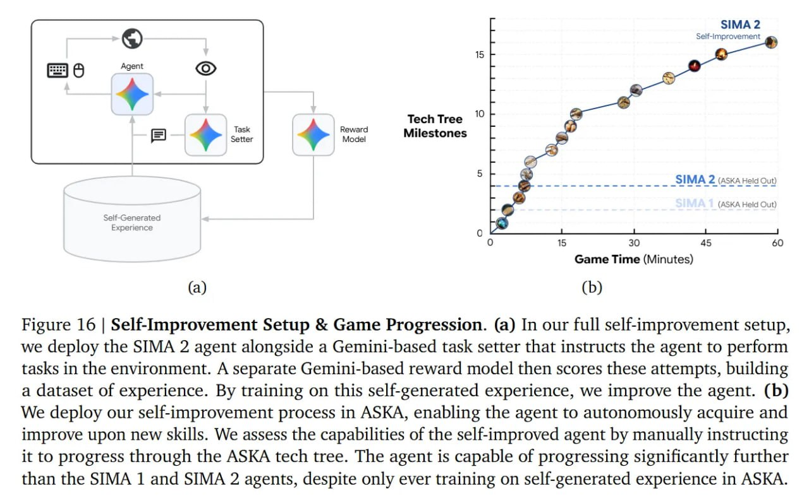

# Image Description

**File:** img_1765703869_aqad4bjrgcd0ul_figure_16_self_improvement_setup_amp.jpg
**Original:** image.jpg
**Received:** 1765703869

## Extracted Text (OCR)

Figure 16 | Self-Improvement Setup &amp; Game Progression. (a) In our full self-improvement setup, we deploy the SIMA 2 agent alongside a Gemini-based task setter that instructs the agent to perform tasks in the environment. A separate Gemini-based reward model then scores these attempts, building a dataset of experience. By training on this self-generated experience, we improve the agent. (b) We deploy our self-improvement process in ASKA, enabling the agent to autonomously acquire and improve upon new skills. We assess the capabilities of the self-improved agent by manually instructing it to progress through the ASKA tech tree. The agent is capable of progressing significantly further than the SIMA 1 and SIMA 2 agents, despite only ever training on self-generated experience in ASKA.

<!-- image -->

## Usage Instructions

When referencing this image in markdown:
1. Use relative path based on file location
2. Add descriptive alt text based on OCR content above
3. Add text description BELOW the image for GitHub rendering

Example:
```markdown
 <!-- TODO: Broken image path -->

**Image shows:** [Describe what the image contains based on OCR]
```
