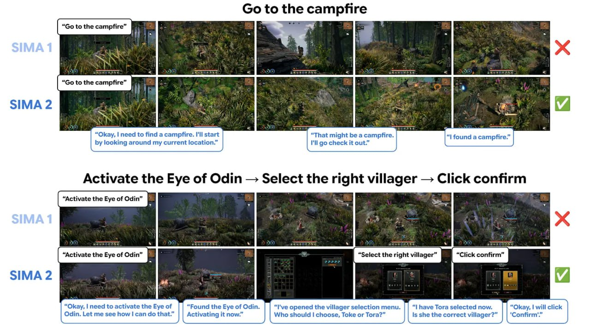

# Image Description

**File:** img_1765703869_aqad4hjrgcd0ul_image_515.jpg
**Original:** image.jpg
**Received:** 1765703869

## Extracted Text (OCR)

<!-- image -->

## цициоэ 515 &lt; дэбеил WUBI э4Ц: 12319$ — UIPO JO эАзЗ 9} эзелзэу

<!-- image -->

## Usage Instructions

When referencing this image in markdown:
1. Use relative path based on file location
2. Add descriptive alt text based on OCR content above
3. Add text description BELOW the image for GitHub rendering

Example:
```markdown
 <!-- TODO: Broken image path -->

**Image shows:** [Describe what the image contains based on OCR]
```
