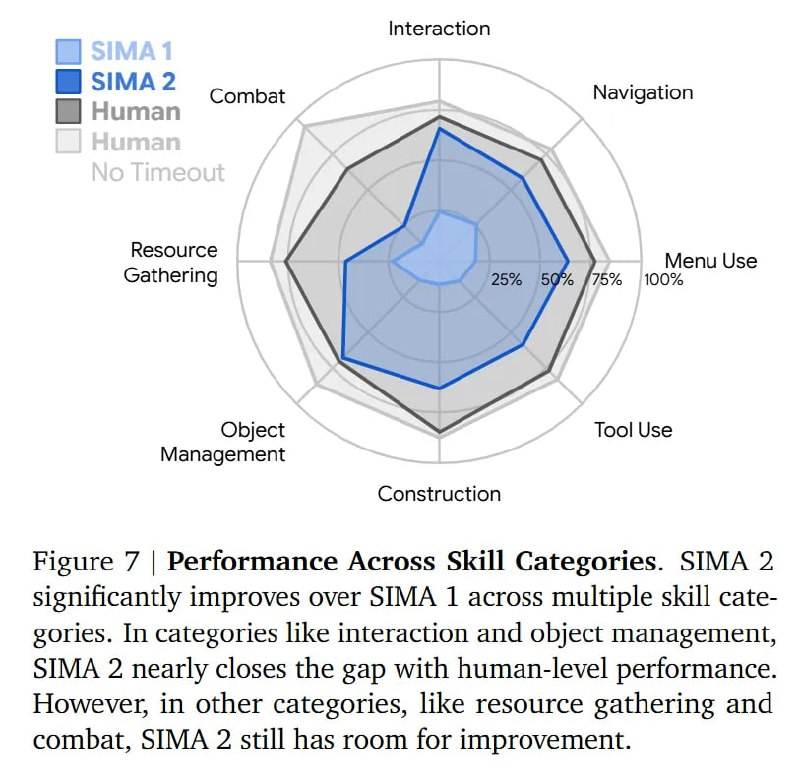

# Image Description

**File:** img_1765703869_aqad4rjrgcd0ul9_image_figure_7.jpg
**Original:** image.jpg
**Received:** 1765703869

## Extracted Text (OCR)

<!-- image -->

Figure 7 | Performance Across Skill Categories. SIMA 2 significantly improves over SIMA 1 across multiple skill categories. In categories like interaction and object management, SIMA 2 nearly closes the gap with human-level performance. However, in other categories, like resource gathering and combat, SIMA 2 still has room for improvement.

## Usage Instructions

When referencing this image in markdown:
1. Use relative path based on file location
2. Add descriptive alt text based on OCR content above
3. Add text description BELOW the image for GitHub rendering

Example:
```markdown
 <!-- TODO: Broken image path -->

**Image shows:** [Describe what the image contains based on OCR]
```
