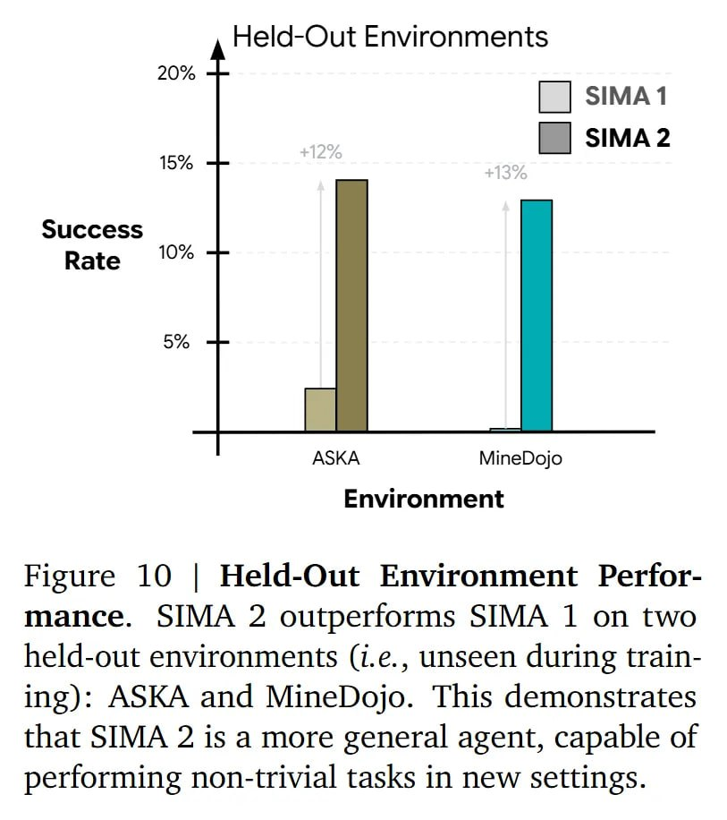

# Image Description

**File:** img_1765703869_aqad4xjrgcd0ul_image_figure_10.jpg
**Original:** image.jpg
**Received:** 1765703869

## Extracted Text (OCR)

<!-- image -->

Figure 10 | Held-Out Environment Performance. SIMA 2 outperforms SIMA 1 on two held-out environments (1.е., unseen during training): ASKA and MineDojo. This demonstrates that SIMA 2 is a more general agent, capable of performing non-trivial tasks in new settings.

## Usage Instructions

When referencing this image in markdown:
1. Use relative path based on file location
2. Add descriptive alt text based on OCR content above
3. Add text description BELOW the image for GitHub rendering

Example:
```markdown
 <!-- TODO: Broken image path -->

**Image shows:** [Describe what the image contains based on OCR]
```
