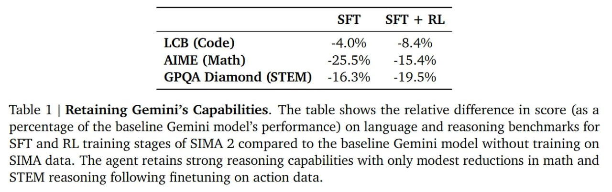

# Image Description

**File:** img_1765703869_aqad5bjrgcd0ul_set_sft_rl.jpg
**Original:** image.jpg
**Received:** 1765703869

## Extracted Text (OCR)

|                                   | SET SFT + RL   |
|-----------------------------------|----------------|
| LCB (Code) -4.0% -8.4%            |                |
| AIME (Math) -25.5% #£=-15.4%      |                |
| GPOA Diamond (STEM) -16.3% -19.5% |                |

Table 1 | Retaining Gemini's Capabilities. The table shows the relative difference in score (as a percentage of the baseline Gemini model's performance) on language and reasoning benchmarks for SFT and RL training stages of SIMA 2 compared to the baseline Gemini model without training on SIMA data. The agent retains strong reasoning capabilities with only modest reductions in math and STEM reasoning following finetuning on action data.

## Usage Instructions

When referencing this image in markdown:
1. Use relative path based on file location
2. Add descriptive alt text based on OCR content above
3. Add text description BELOW the image for GitHub rendering

Example:
```markdown
 <!-- TODO: Broken image path -->

**Image shows:** [Describe what the image contains based on OCR]
```
