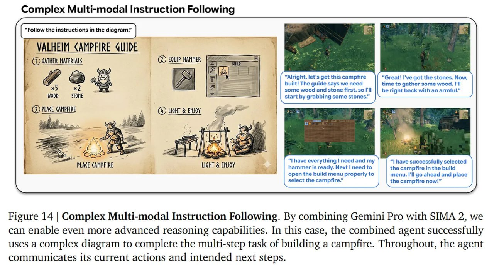

# Image Description

**File:** img_1765703869_aqad5rjrgcd0ul_complex_multi_modal_instruction_followin.jpg
**Original:** image.jpg
**Received:** 1765703869

## Extracted Text (OCR)

## Complex Multi-modal Instruction Following

<!-- image -->

Figure 14 | Complex Multi-modal Instruction Following. By combining Gemini Pro with SIMA 2, we can enable even more advanced reasoning capabilities. In this case, the combined agent successfully uses a complex diagram to complete the multi-step task of building a campfire. Throughout, the agent communicates its current actions and intended next steps.

## Usage Instructions

When referencing this image in markdown:
1. Use relative path based on file location
2. Add descriptive alt text based on OCR content above
3. Add text description BELOW the image for GitHub rendering

Example:
```markdown
 <!-- TODO: Broken image path -->

**Image shows:** [Describe what the image contains based on OCR]
```
