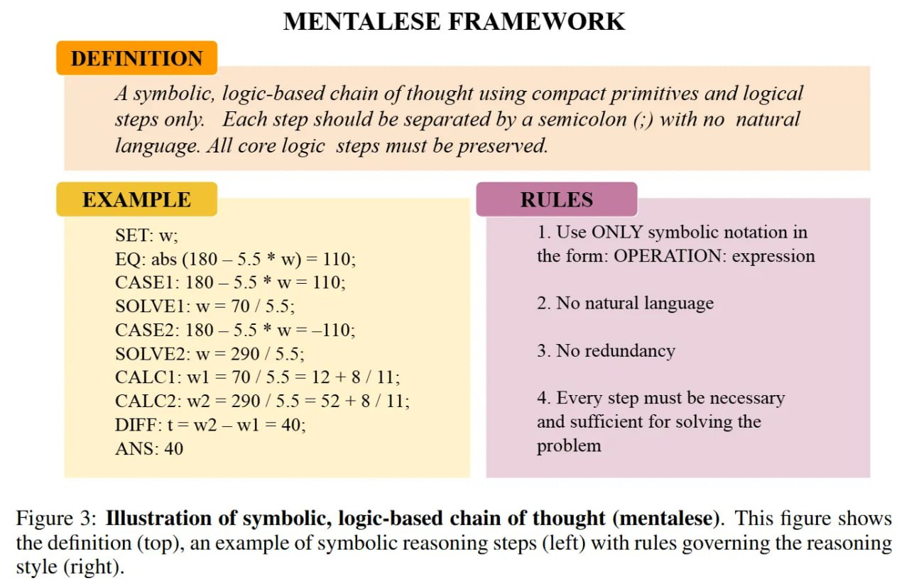

# Image Description

**File:** img_1765703912_aqadna9rg1uu4ul_a_symbolic_logic_based_chain_of_thought.jpg
**Original:** image.jpg
**Received:** 1765703912

## Extracted Text (OCR)

A symbolic, logic-based chain of thought using compact primitives and logical steps only. Each step should be separated by a semicolon (;) with no natural language. All core logic steps must be preserved.

- SET: w: 1. Use ONLY symbolic notation in EQ: abs (180 — 5.5 * w) = 110: the form: OPERATION: expression
- SOLVE1: w= 70 / 5.5: 2. No natural language
- SOLVE2: w = 290 / 5.5: 3. No redundancy
- САГ.С2: w2 = 290 /5.5 = 52+8/11: 4. Every step must be necessary DIFF: t = w2 — wl = 40: and sufficient for solving the

CASEI: 180—5.5 * w= 110:

CASE2: 180 —5.5 * w=—-110:

CALCI: wl = /0/5.5=12+48/ II:

ANS: 40 problem

Figure 3: Illustration of symbolic, logic-based chain of thought (mentalese). [his figure shows the definition (top), an example of symbolic reasoning steps (left) with rules governing the reasoning style (right).

## Usage Instructions

When referencing this image in markdown:
1. Use relative path based on file location
2. Add descriptive alt text based on OCR content above
3. Add text description BELOW the image for GitHub rendering

Example:
```markdown
 <!-- TODO: Broken image path -->

**Image shows:** [Describe what the image contains based on OCR]
```
