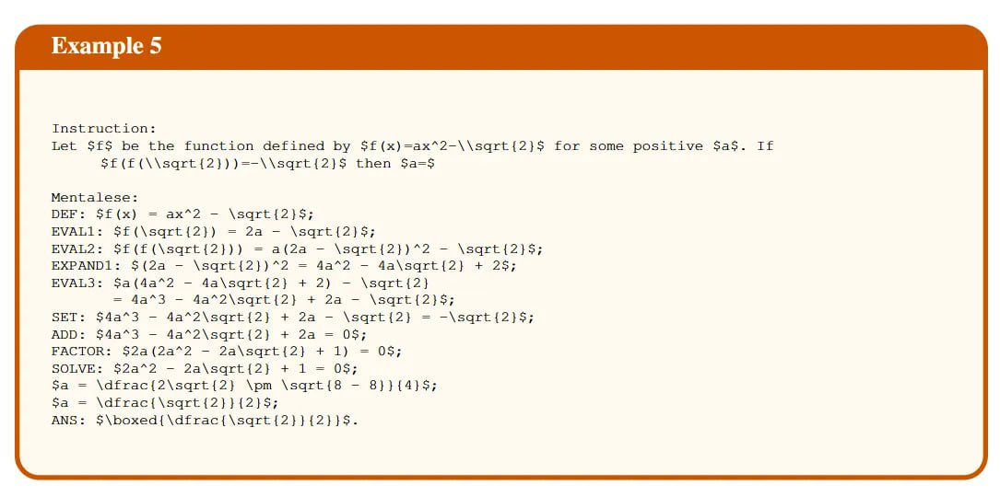

# Image Description

**File:** img_1765703912_aqadnq9rg1uu4ul_kxxample_5_tnstriction_let.jpg
**Original:** image.jpg
**Received:** 1765703912

## Extracted Text (OCR)

## KXxample 5

```
Tnstriction: Let 5Е$ be the function defined by Sf (x)=ax*2-\\sqrt{2}5 for some positive Sas. If Sf(f(\\sqrt{2}))=-\\sart{2}5 then $а=$ Mentalese: DEF: Sfi(x) = ax*2 — \saqrt{2}5; EVALI: Sf(\sqrt({2}) = 2a — \sqrt{2}5; EVAL2: Sf(f£(\sqrt{2})) = а(2а - \sqrt{2})*2 — \sqrt{2}4; EXPANDI: S{2a - \sqrt{2})*2 = 4a*2 - da\sort{2} + 25; EVAL3: Sa(4a*%2 — da\sqrt{2} + 2) — \sqrt{2] = 4a*°3 - 4da*2\sqrt{2} + 2а — \sart{2}5$; SET: S54a°3 — 4a*2\saqrt{2} + 2a — \sqrt{2} = -\saqrt{2}5; ADD: $4а^3 — 4а^2\закЕ [2] + 2a = 05 FACTOR: 52а {(2а^2 — 2a\sqrt{2} + 1) = 05; SOLVE: S2a*%2 — 2Za\sart{2} + 1 = 0$: Sa = \dfrac{2\sqrt{2} \pm \sart{8 - 8}}{4}5; Sa = \dfrac{\saqrt{2}}{2}5; ANS: 5\boxed{\dfrac{\sqrt{2}}{2}}58.
```

## Usage Instructions

When referencing this image in markdown:
1. Use relative path based on file location
2. Add descriptive alt text based on OCR content above
3. Add text description BELOW the image for GitHub rendering

Example:
```markdown
 <!-- TODO: Broken image path -->

**Image shows:** [Describe what the image contains based on OCR]
```
