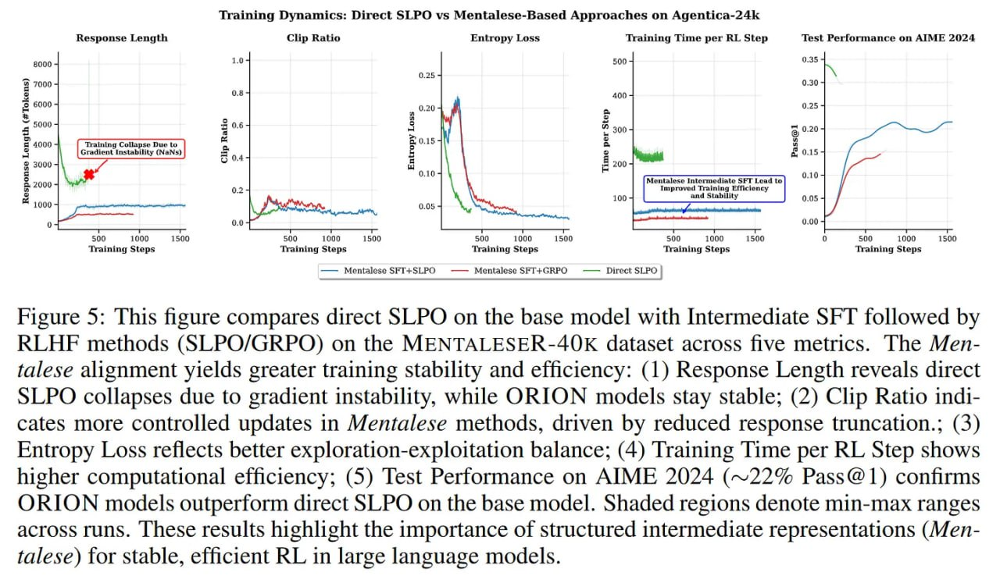

# Image Description

**File:** img_1765703912_aqadow9rg1uu4ul_training_dynamics_direct_slpo_vs.jpg
**Original:** image.jpg
**Received:** 1765703912

## Extracted Text (OCR)

## Training Dynamics: Direct SLPO vs Mentalese-Based Approaches on Agentica-24k

Figure 5: [his figure compares direct SLPO on the base model with Intermediate SFT followed by КЕНЕ methods (SLPO/GRPO) on the MENTALESER-40OK dataset across five metrics. The Mentalese alignment yields greater training stability and efficiency: (1) Response Length reveals direct SLPO collapses due to gradient instability, while ORION models stay stable; (2) Clip Ratio indicates more controlled updates in Mentalese methods, driven by reduced response truncation.; (3) Entropy Loss reflects better exploration-exploitation balance; (4) Training 'Time рег RL Step shows higher computational efficiency; (5) lest Performance on AIME 2024 (~22% Pass@1) confirms ORION models outperform direct SLPO on the base model. Shaded regions denote min-max ranges across runs. These results highlight the importance of structured intermediate representations (Mentalese) for stable, efficient RL ш large language models.

<!-- image -->

## Usage Instructions

When referencing this image in markdown:
1. Use relative path based on file location
2. Add descriptive alt text based on OCR content above
3. Add text description BELOW the image for GitHub rendering

Example:
```markdown
 <!-- TODO: Broken image path -->

**Image shows:** [Describe what the image contains based on OCR]
```
