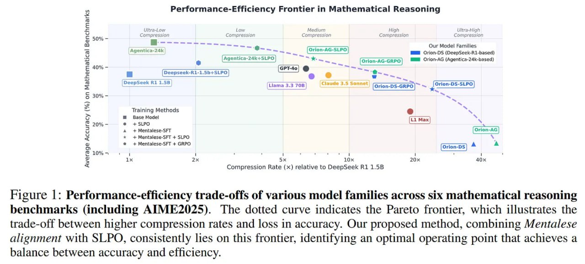

# Image Description

**File:** img_1765703912_aqadpg9rg1uu4ul_figure_performance_efficiency_trade_offs.jpg
**Original:** image.jpg
**Received:** 1765703912

## Extracted Text (OCR)

Figure |: Performance-efficiency trade-offs of various model families across six mathematical reasoning benchmarks (including AIME2025). The dotted curve indicates the Pareto frontier, which illustrates the trade-off between higher compression rates and loss ш accuracy. Our proposed method, combining Mentalese alignment with SLPO, consistently lies on this frontier, identifying an optimal operating point that achieves a balance between accuracy and efficiency.

<!-- image -->

## Usage Instructions

When referencing this image in markdown:
1. Use relative path based on file location
2. Add descriptive alt text based on OCR content above
3. Add text description BELOW the image for GitHub rendering

Example:
```markdown
 <!-- TODO: Broken image path -->

**Image shows:** [Describe what the image contains based on OCR]
```
