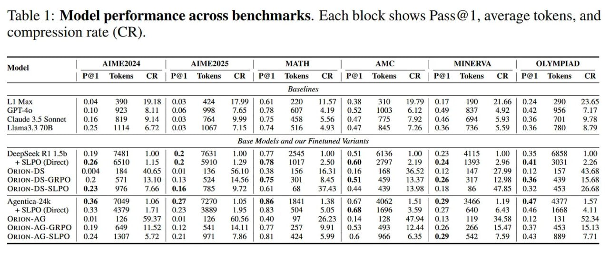

# Image Description

**File:** img_1765703912_aqadpw9rg1uu4ul_table_1_model_performance_across_benchma.jpg
**Original:** image.jpg
**Received:** 1765703912

## Extracted Text (OCR)

Table 1: Model performance across benchmarks. Each block shows Pass@1, average tokens, and compression rate (CR).

|                                                                                                                                                                                                                                                    | Model  AIME2024 | AIME2025 | МАТН АМС | MINERVA | OLYMPIAD   | Model  AIME2024 | AIME2025 | МАТН АМС | MINERVA | OLYMPIAD                                      | Model  AIME2024 | AIME2025 | МАТН АМС | MINERVA | OLYMPIAD   |                         |                         |                         |                         |                         |                         |                         |                         |                         |                         |                         |                         |                         |                         |                         |
|----------------------------------------------------------------------------------------------------------------------------------------------------------------------------------------------------------------------------------------------------|--------------------------------------------------------------|-------------------------------------------------------------------------------------------------|--------------------------------------------------------------|-------------------------|-------------------------|-------------------------|-------------------------|-------------------------|-------------------------|-------------------------|-------------------------|-------------------------|-------------------------|-------------------------|-------------------------|-------------------------|-------------------------|-------------------------|
|                                                                                                                                                                                                                                                    |                                                              | | P@1 Tokens CR | РОГ Tokens CR | P@1 Tokens CR | P@1 Tokens CR | P@1 Tokens CR | P@1 Tokens CR |                                                              |                         |                         |                         |                         |                         |                         |                         |                         |                         |                         |                         |                         |                         |                         |                         |
| baselines                                                                                                                                                                                                                                          | baselines                                                    | baselines                                                                                       | baselines                                                    | baselines               | baselines               | baselines               | baselines               | baselines               | baselines               | baselines               | baselines               | baselines               | baselines               | baselines               | baselines               | baselines               | baselines               | baselines               |
| 77. ]7 Сана 3.5 Sonnet | 0.16 RIO 914 | O03 Tha 9990 | 07% ASR “56 | АТ TTS 707 | 046 O04 5011036 TO] 9 TR                                                                                                                                         |                                                              |                                                                                                 |                                                              |                         |                         |                         |                         |                         |                         |                         |                         |                         |                         |                         |                         |                         |                         |                         |
| dour Finetuned Vartants                                                                                                                                                                                                                            | dour Finetuned Vartants                                      | dour Finetuned Vartants                                                                         | dour Finetuned Vartants                                      | dour Finetuned Vartants | dour Finetuned Vartants | dour Finetuned Vartants | dour Finetuned Vartants | dour Finetuned Vartants | dour Finetuned Vartants | dour Finetuned Vartants | dour Finetuned Vartants | dour Finetuned Vartants | dour Finetuned Vartants | dour Finetuned Vartants | dour Finetuned Vartants | dour Finetuned Vartants | dour Finetuned Vartants | dour Finetuned Vartants |
| WDeepseck КТ 1.55 | 9.18 1461 109 | 9.2 1631 LOU | ОР 2545 1.00 | О 6136 100 | O25 £4015 1.00 | O35 6858 1.00 +S5LPO (Direct) | 6.26 6510 1.15 | 9.2 5910 1.29 | O78 КР 250) | O60 2/97 2.19 | 0.24 1393 2.96 | 09.41 S303] 2.26 ()RION-  DS-SLPO) |                                                              |                                                                                                 |                                                              |                         |                         |                         |                         |                         |                         |                         |                         |                         |                         |                         |                         |                         |                         |                         |
| ()RION-  DS-O,RPO) |                                                                                                                                                                                                                               |                                                              |                                                                                                 |                                                              |                         |                         |                         |                         |                         |                         |                         |                         |                         |                         |                         |                         |                         |                         |                         |
| Agentica-24k | 0.36 3949 106 | O27 7270 1.05 | 0.86 1841 1.38 | 067 4062 1.51 | 0.29 3466 1.19 | O47 84377 1.57                                                                                                                                    |                                                              |                                                                                                 |                                                              |                         |                         |                         |                         |                         |                         |                         |                         |                         |                         |                         |                         |                         |                         |                         |
| + SLPO (Direct)  | (33  43/9  | РД |  0.23  3859  1.95 | 083  504  5.05 | 0.68  1696  359 | 0.21  640)  0.46  1668 (JRION-AGr                                                                                                                      |                                                              |                                                                                                 |                                                              |                         |                         |                         |                         |                         |                         |                         |                         |                         |                         |                         |                         |                         |                         |                         |
| (ORION- AG -                                                                                                                                                                                                                                       |                                                              |                                                                                                 |                                                              |                         |                         |                         |                         |                         |                         |                         |                         |                         |                         |                         |                         |                         |                         |                         |
| OrRION-AG-SLPO | 024 1307 577107 971 те | 04| 424 599 | 06 9656 6.35 | (29 §49 759 | 0.43 RRO                                                                                                                                                      |                                                              |                                                                                                 | Т.Р]                                                         |                         |                         |                         |                         |                         |                         |                         |                         |                         |                         |                         |                         |                         |                         |                         |

## Usage Instructions

When referencing this image in markdown:
1. Use relative path based on file location
2. Add descriptive alt text based on OCR content above
3. Add text description BELOW the image for GitHub rendering

Example:
```markdown
 <!-- TODO: Broken image path -->

**Image shows:** [Describe what the image contains based on OCR]
```
