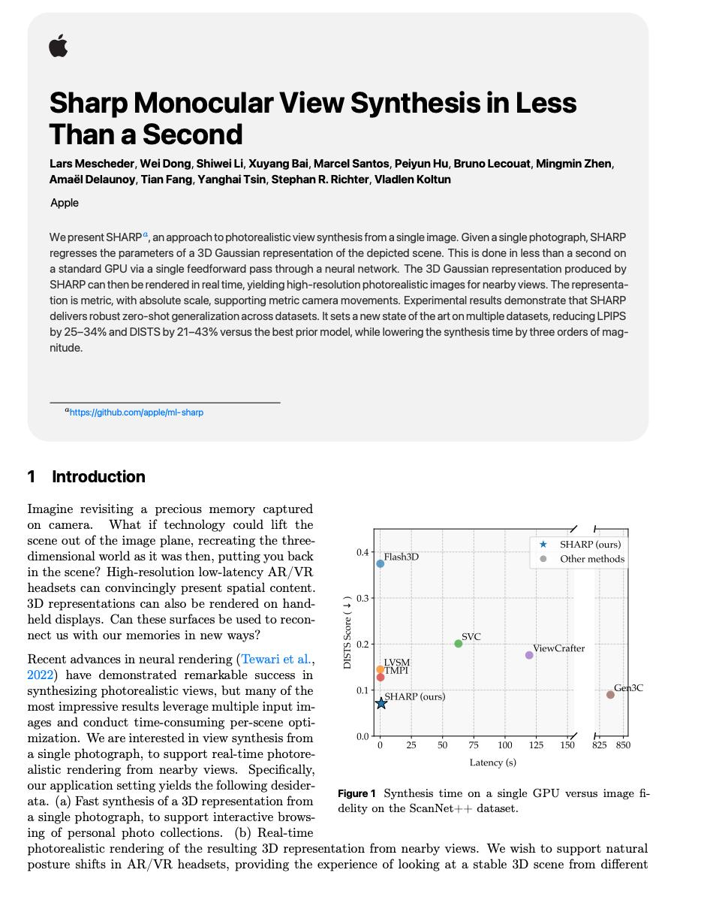

# Image Description

**File:** img_1765933474_aqadfhnrgjaafkfg_image_sharp_monocular.jpg
**Original:** image.jpg
**Received:** 1765933474

## Extracted Text (OCR)

<!-- image -->

## Sharp Monocular View Synthesis т Less Than a Seconda

Lars Mescheder, Wei Dong, Shiwei Li, Xuyang Bai, Marcel Santos, Peryun Hu, Bruno Lecouat, Mingmin Zhen, Amael Delaunoy, Tian Fang, Yanghai Tsin, Stephan R. Richter, Viadlen Koltun

Apple

We present SHARP", ап approach to photorealistic view synthesis from а single image. Given a single photograph, SHARP reqresses the parameters of a 3D Gaussian representation of the depicted scene. [his is done in jess than a second on a standard GPU via а single Teedrorward pass througn a neural network. Пе 30 Gaussian representation produced by SFARP can then be rendered in real time, yielding high-resolution photorealistic images for nearby views. [he representation is metric, with absolute scale, supporting metric camera movements. Experimental results demonstrate that SHARP delivers rooust zero-snot generalization across datasets. It sets a new State of the art on multiple datasets, reducing LPIPS DY 22-34% and DIS|S by 21-43% versus the best prior model, while lowering the synthesis time by three orders of magприа=а

“httos://github.com/apple/ml-sharp

## 1 Introduction

[заре revisiting a precious Memory captured on camera. What if technology could lift the scene out of the image plane, recreating the three- | * SHARP (ours) dimensional world as it was then, putting you back we | i lashab @ Офок methods in the scene'? High-resolution low-latency AR/ VR headsets can convincingly present spatial content. 3D) representations can also be rendered on handheld displays. Can these surfaces be used to reconSVC

Se

nect us with our memories in new ways?

Recent advances in neural rendering ('Tewari et al. 2022) have demonstrated remarkable success in synthesizing photorealistic views, but many of the

9.1 ] | SHARP (ours)

on most impressive results leverage multiple input images and conduct time-consuming per-scene optimization. We are interested in view synthesis from ор es A

я aa en = ow) члЕ= 4er) a single photograph, to support real-time photorealistic rendering from nearby views. Specifically. our application setting yields the following desiderata. (a) Fast synthesis of a 3D representation from a single photograph, to support interactive browsing of personal photo collections. (b) Real-time Latency |s] Figure 1 Synthesis time on a single (sPU versus image fdehty on the scanNet+--+- dataset.

<!-- image -->

photorealistic rendering of the resulting 3D representation from nearby views. We wish to support natural posture shifts in AR VR headsets, providing the experience of looking at a stable 3D scene from different

## Usage Instructions

When referencing this image in markdown:
1. Use relative path based on file location
2. Add descriptive alt text based on OCR content above
3. Add text description BELOW the image for GitHub rendering

Example:
```markdown
 <!-- TODO: Broken image path -->

**Image shows:** [Describe what the image contains based on OCR]
```
