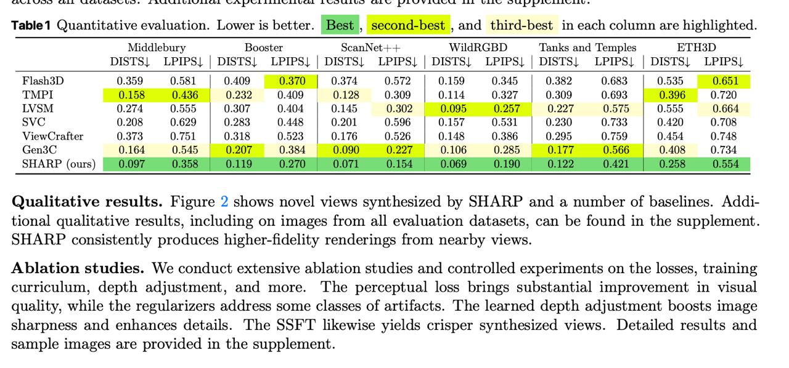

# Image Description

**File:** img_1765933474_aqadgrnrgjaafkfg_and_es_ca_ec_rk.jpg
**Original:** image.jpg
**Received:** 1765933474

## Extracted Text (OCR)

AND eS CA EC мыла Rk a EE aa ef a ee ВЕЛА ЕЕ а

Table1 Quantitative evaluation. Lower is better. ‘Best , second-best , and third-best in each column are highlighted.

|                                                                                                    |                                                                              |                                                                                               | Nhuddlebury Booster scanNet++ WildRGbBD lanks and lLemples BlHSD   | Nhuddlebury Booster scanNet++ WildRGbBD lanks and lLemples BlHSD   |
|----------------------------------------------------------------------------------------------------|------------------------------------------------------------------------------|-----------------------------------------------------------------------------------------------|--------------------------------------------------------------------|--------------------------------------------------------------------|
|                                                                                                    |                                                                              | DISTS| LPIPS| | DISTS| LPIPS| | DISTS| LPIPS| | DISTS| LPIPS| | DISTS| LPIPS| | DISTS| LPIPS| |                                                                    |                                                                    |
| Flash3D 0.359 0.581 | 0.409 0.370 | 0.374 0.572 | 0.159 0.345 | 0.382 0.683                        |                                                                              |                                                                                               |                                                                    |                                                                    |
| TMPI 0.158 0436) 0.232 0.409 0.128 0.309 | 0.114 0.327 | 0.309 0.693 | 0.396 0.720                 |                                                                              |                                                                                               |                                                                    |                                                                    |
|                                                                                                    | А 0.208 0629 | 02853 0.448 | 0901 0.506 | 0157 0531 | 020 0.733 | 0420 0.708 |                                                                                               |                                                                    |                                                                    |
| ViewCraiter 0.373 — 0.751 | 0.318 — 0.523 | 0.16 — 0.526 | 0.148 0.386 | 0.295 0.799 | 9.454 0.748 |                                                                              |                                                                                               |                                                                    |                                                                    |
| SHARP (ours) —                                                                                     |                                                                              |                                                                                               |                                                                    |                                                                    |

Qualitative results. Figure 2 shows novel views synthesized by SHARP and a number of baselines. Additional qualitative results, including on images from all evaluation datasets, can be found in the supplement. HARP consistently produces higher-fidelity renderings from nearby views.

Ablation studies. We conduct extensive ablation studies and controlled experiments on the losses, training curriculum, depth adjustment, and more. 'l'he perceptual loss brings substantial improvement in visual quality, while the regularizers address some classes of artifacts. The learned depth adjustment boosts image sharpness and enhances details. [he SSH'I likewise yields crisper synthesized views. Detailed results and sample images are provided in the supplement.

## Usage Instructions

When referencing this image in markdown:
1. Use relative path based on file location
2. Add descriptive alt text based on OCR content above
3. Add text description BELOW the image for GitHub rendering

Example:
```markdown
 <!-- TODO: Broken image path -->

**Image shows:** [Describe what the image contains based on OCR]
```
