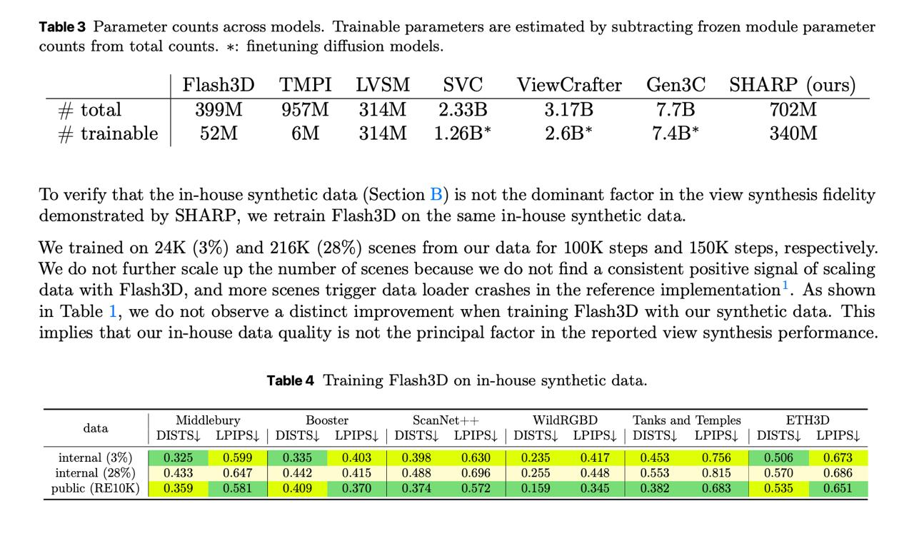

# Image Description

**File:** img_1765933474_aqadgxnrgjaafkfg_table_3_parameter_counts_across_models.jpg
**Original:** image.jpg
**Received:** 1765933474

## Extracted Text (OCR)

Table 3 Parameter counts across models. 'Trainable parameters are estimated by subtracting frozen module parameter counts from total counts. *: finetuning diffusion models.

|                                                   | Flash3D TMPI LVSM SVC _ ViewCrafter Gen3C SHARP (ours)   |
|---------------------------------------------------|----------------------------------------------------------|
| ++ total | 399M 957M 314M — 2.33B 3.17B 7.7В 702M |                                                          |
| + trainable | d2M 6M 314M 1.26В* 2.6B* 1.4B* 340M |                                                          |

To verify that the in-house synthetic data (Section B) is not the dominant factor in the view synthesis fidelity demonstrated by SHARP, we retrain Flash3D on the same in-house synthetic data.

We trained on 24K (37%) and 216K (28%) scenes from our data for 100K steps and 150K steps, respectively. We do not further scale up the number of scenes because we do not find a consistent positive signal of scaling data with Flash3D, and more scenes trigger data loader crashes in the reference implementation'. As shown in 'Table 1, we do not observe a distinct improvement when training Flash3D with our synthetic data. This implies that our in-house data quality is not the principal factor in the reported view synthesis performance.

Table 4 ‘lraining Flash3D on in-house synthetic data.

|                 |                                                                                                    | Middlebury Booster scanNet++- WildRGBD ‘Tanks and ‘Temples ETH3D  = we Peer п = eh. ee} ь | ee Se eee гы | a Ра = we i | рег с Se = т [_ — wee eee = т ee | =...   | Middlebury Booster scanNet++- WildRGBD ‘Tanks and ‘Temples ETH3D  = we Peer п = eh. ee} ь | ee Se eee гы | a Ра = we i | рег с Se = т [_ — wee eee = т ee | =...   |
|-----------------|----------------------------------------------------------------------------------------------------|--------------------------------------------------------------------------------------------------------------------------------------------------------------------|--------------------------------------------------------------------------------------------------------------------------------------------------------------------|
|                 | oe | DISTS| LPIPS| | DISTS! LPIPS| | DISTS| LPIPS| | DISTS| LPIPS| | DISTS| LPIPS| | DISTS| LPIPS| |                                                                                                                                                                    |                                                                                                                                                                    |
| internal (3%)   |                                                                                                    |                                                                                                                                                                    |                                                                                                                                                                    |
| internal (28%)  | 0.433 0.647 | 0.442 0.415 | 09.488 0.696 | 09.255 0.448 | 0.553 0.510 | 0.59 0.686                 |                                                                                                                                                                    |                                                                                                                                                                    |
| public (RE10K } |                                                                                                    |                                                                                                                                                                    |                                                                                                                                                                    |

## Usage Instructions

When referencing this image in markdown:
1. Use relative path based on file location
2. Add descriptive alt text based on OCR content above
3. Add text description BELOW the image for GitHub rendering

Example:
```markdown
 <!-- TODO: Broken image path -->

**Image shows:** [Describe what the image contains based on OCR]
```
