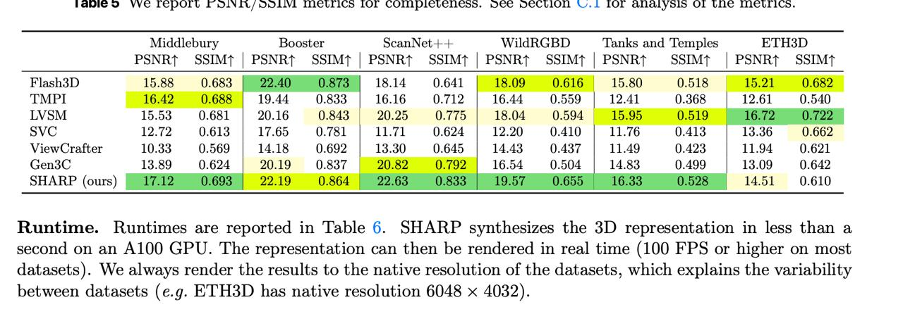

# Image Description

**File:** img_1765933474_aqadhbnrgjaafkfg_pool_il_oolive_te.jpg
**Original:** image.jpg
**Received:** 1765933474

## Extracted Text (OCR)

уе СРО Pool IL OOLIVE Te urics ФЕ COMDICTCTICss. OCC OCCLIO“N W.1l ЛО dlalVols OF Le Te urics.

|              | Middlebury Booster   | Middlebury Booster        | scanNet++ WildRGBD ‘Tanks and ‘Temples ETH3D   | scanNet++ WildRGBD ‘Tanks and ‘Temples ETH3D        |                                                      |                                                           |
|--------------|----------------------|---------------------------|------------------------------------------------|-----------------------------------------------------|------------------------------------------------------|-----------------------------------------------------------|
|              |                      | PSNRt SSIMt | PSNRt SSIMT |                                                |                                                     | PSNRT SSIMT | PSNRT SSIMT | PSNRT SSIMT | РМАТ SSIMT |                                                           |
| Hlash3 bl    |                      |                           |                                                | 18.14 0.641 | 18.09 0.616 | 15.80 0.518 15.21 0.682 |                                                      |                                                           |
|              |                      |                           |                                                |                                                     |                                                      | 16.16 — 0.712 | 1644 — 0.559 | 1241 — 0.368 | 12.61 0.540 |
|              |                      | 15.53 0.681 | 2016 08423  |                                                |                                                     |                                                      | 20.25 0.775 | 18.04 0.594 15.95 0.519 — 1672 0.722        |
|              |                      | 1613  1/.65               |                                                |                                                     |                                                      | 11.71 0.694 | 123.90 0.410 | 11.76 0.413 | 13.36 0.662    |
| View Cratter |                      |                           |                                                |                                                     |                                                      | 1.9.19]  ().645  14  wha  Па  11.44  Па  11.3  4  bi? |   |
|              |                      |                           |                                                |                                                     |                                                      | 0.504 | 14.83 0.49                                        |
| SHARP (ours) |                      |                           |                                                |                                                     |                                                      |                                                           |

Runtime. Runtimes are reported in 'Table 6. SHARP synthesizes the 3D representation in less than a second on an A100 СРО. The representation can then be rendered in real time (100 FPS or higher on most datasets). We always render the results to the native resolution of the datasets, which explains the variability between datasets (e.g. ETH3D has native resolution 6048 x 4032).

## Usage Instructions

When referencing this image in markdown:
1. Use relative path based on file location
2. Add descriptive alt text based on OCR content above
3. Add text description BELOW the image for GitHub rendering

Example:
```markdown
 <!-- TODO: Broken image path -->

**Image shows:** [Describe what the image contains based on OCR]
```
