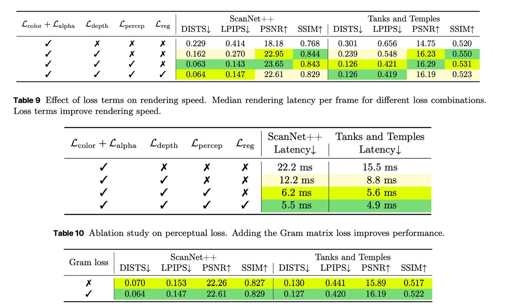

# Image Description

**File:** img_1765933474_aqadhhnrgjaafkfg_scannet_and_lemples.jpg
**Original:** image.jpg
**Received:** 1765933474

## Extracted Text (OCR)

|            | scanNet-++ Тапкз and Lemples  Poi - Pipe = С аречь ГИ ДД =~ НЕ | о ара ow | =n Se, A ee ee а, SF [ees | =~ Se. 1   | scanNet-++ Тапкз and Lemples  Poi - Pipe = С аречь ГИ ДД =~ НЕ | о ара ow | =n Se, A ee ee а, SF [ees | =~ Se. 1   | scanNet-++ Тапкз and Lemples  Poi - Pipe = С аречь ГИ ДД =~ НЕ | о ара ow | =n Se, A ee ee а, SF [ees | =~ Se. 1   | scanNet-++ Тапкз and Lemples  Poi - Pipe = С аречь ГИ ДД =~ НЕ | о ара ow | =n Se, A ee ee а, SF [ees | =~ Se. 1   |
|------------|--------------------------------------------------------------------------------------------------------------------|--------------------------------------------------------------------------------------------------------------------|--------------------------------------------------------------------------------------------------------------------|--------------------------------------------------------------------------------------------------------------------|
|            | color alpha depth percep Teg | DISTS| LPIPS| PSNRt SSIMt | DISTS| LPIPS| РЗМЕЛ SSIMT                               |                                                                                                                    |                                                                                                                    |                                                                                                                    |
|            | 0.229 0.414 18.18 0.768 | 0.21 0.656 14.79 0.520                                                                   |                                                                                                                    |                                                                                                                    |                                                                                                                    |
|            | 0.162  0.270  9 OF                                                                                                 |                                                                                                                    |                                                                                                                    |                                                                                                                    |
| <~ < м ‘NY |                                                                                                                    |                                                                                                                    |                                                                                                                    |                                                                                                                    |
|            | 2 61  ().829  0.126  0.219  16.19                                                                                  |                                                                                                                    |                                                                                                                    |                                                                                                                    |

Table 9 Effect of loss terms on rendering speed. Median rendering latency per frame for different loss combinations. Loss terms improve rendering speed.

| ScanNet+-+ ‘Tanks and lemples YICAaADINCU---- 1айвь ADC LeCMp  aah + Sara С аерь С регсер Eves Latency) | Latency   |
|---------------------------------------------------------------------------------------------------------------------|
| 27.2 т | 15.5 Ms                                                                                                    |
| 12.2 ms  4 ms                                                                                                       |

Table 10 Ablation study on perceptual loss. Adding the Gram matrix loss improves performance.

| (sram loss   | scanNet+-++ Tanks and ‘Temples   | scanNet+-++ Tanks and ‘Temples                        | scanNet+-++ Tanks and ‘Temples   | scanNet+-++ Tanks and ‘Temples   |
|--------------|----------------------------------|-------------------------------------------------------|----------------------------------|----------------------------------|
| (sram loss   |                                  | DISTS| LPIPS| PSNRt SSIMt | DISTS! LPIPS| PSNRt SSIMt |                                  |                                  |

## Usage Instructions

When referencing this image in markdown:
1. Use relative path based on file location
2. Add descriptive alt text based on OCR content above
3. Add text description BELOW the image for GitHub rendering

Example:
```markdown
 <!-- TODO: Broken image path -->

**Image shows:** [Describe what the image contains based on OCR]
```
