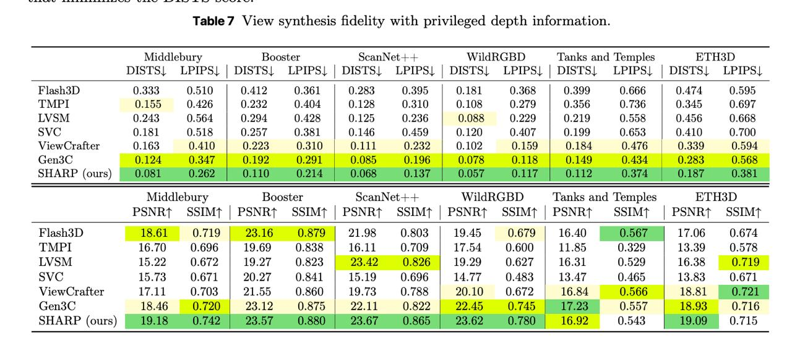

# Image Description

**File:** img_1765933474_aqadhrnrgjaafkfg_table_7_view_synthesis_fidelity_with.jpg
**Original:** image.jpg
**Received:** 1765933474

## Extracted Text (OCR)

Table 7 View synthesis fidelity with privileged depth information.

|                                                                                                  |                                                                                      |                                                                                       | Wliddlebury Booster scanNet++ WildRGBD ‘Tanks and ‘Temples ETHSD                              | Wliddlebury Booster scanNet++ WildRGBD ‘Tanks and ‘Temples ETHSD   |
|--------------------------------------------------------------------------------------------------|--------------------------------------------------------------------------------------|---------------------------------------------------------------------------------------|-----------------------------------------------------------------------------------------------|--------------------------------------------------------------------|
|                                                                                                  |                                                                                      |                                                                                       | DISTS| LPIPS| | DISTS| LPIPS| | DISTS| LPIPS| | DISTS| LPIPS| | DISTS| LPIPS| | DISTS| LPIPS| |                                                                    |
| К] ав  0.333  0.510  0.412  0.361  0.383  0.395  0.181  0.368  0.399  0.666  0.474  0.595        |                                                                                      |                                                                                       |                                                                                               |                                                                    |
| TMPI  0.155  0.496  0.232  0.404  0.128  0.310  0.108  0.279  0.356  0.736  0.345  0.697         |                                                                                      |                                                                                       |                                                                                               |                                                                    |
| 0.945  0.4564  0.994  (1). 498  0.135  936  088  {920  0.919  0.558  0.456  0.668                |                                                                                      |                                                                                       |                                                                                               |                                                                    |
|                                                                                                  | 0.181  O518  [257  0.31  0.146  ().459  0.120  0.407  0.199  0.653  0.410  0.700     |                                                                                       |                                                                                               |                                                                    |
| ViewCratfter 0.163 O410 | 0.223 0.30 | 001 0.232 | O.102 0.09 | 0.184 0405 | 0.5359 0.594        |                                                                                      |                                                                                       |                                                                                               |                                                                    |
| (sen3sC                                                                                          |                                                                                      |                                                                                       |                                                                                               |                                                                    |
| SHARP (ours)                                                                                     |                                                                                      |                                                                                       |                                                                                               |                                                                    |
|                                                                                                  |                                                                                      |                                                                                       | Middlebury Booster scanNet++ WildRGBD ‘Tanks and Temples ETH3D                                | Middlebury Booster scanNet++ WildRGBD ‘Tanks and Temples ETH3D     |
|                                                                                                  |                                                                                      |                                                                                       | PSNRt SSIMt | PSNRt SSIMt | PSNRt SSIMT | PSNRt SSIMt | PSNRt  SSIM?t | РЗМАТ  SSIMT          |                                                                    |
| Flash3D 18.61 0.719 | 23.16 0.879 | 21.98 0.803 | 19.45 0.679 | 16.40 | 0567 | 17.06 0.674       |                                                                                      |                                                                                       |                                                                                               |                                                                    |
|                                                                                                  |                                                                                      | 16.70  0.696  19.69  0.838  16.11  0.709  17 54  0.600  11.85  0.399  13.39  0.578    |                                                                                               |                                                                    |
|                                                                                                  |                                                                                      | LVSM 15.22 0.672 | 19.27 0.823 | 23.42 0.826) 19.29 0.627 | 16.31 0.529 16.38 — 0.719 |                                                                                               |                                                                    |
|                                                                                                  | oVvC 15.73 0.671 | 920.97 0.841 | 15.19 0.696 | 14.77 0483 | 1347 0.465 | 1383 057]. |                                                                                       |                                                                                               |                                                                    |
| ViewCratter                                                                                      |                                                                                      |                                                                                       |                                                                                               |                                                                    |
| (sen3C  18.46  0.720 |  23.12  0.875 |  2) 11  0.822 |  272 AS  0.745 | ООО  0.557  18.93  0.716 |                                                                                      |                                                                                       |                                                                                               |                                                                    |
| 19.18 0.742 | 23.57 0.880 | 23.67 0.865 | 23.62 0.780 | 16.92 0.543 | 19.09                      |                                                                                      |                                                                                       |                                                                                               |                                                                    |

## Usage Instructions

When referencing this image in markdown:
1. Use relative path based on file location
2. Add descriptive alt text based on OCR content above
3. Add text description BELOW the image for GitHub rendering

Example:
```markdown
 <!-- TODO: Broken image path -->

**Image shows:** [Describe what the image contains based on OCR]
```
