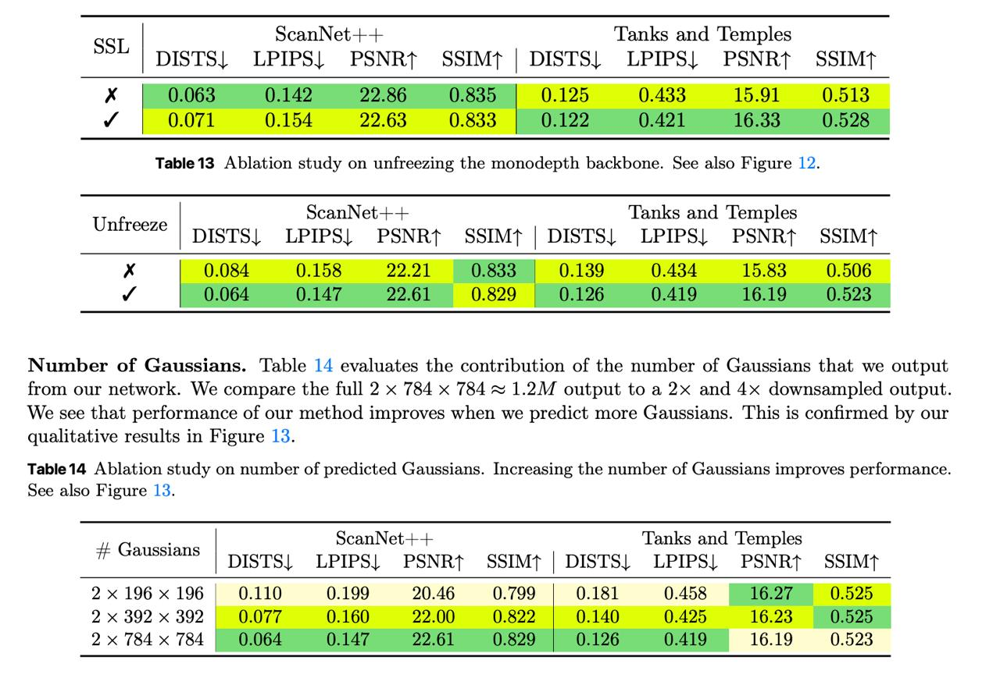

# Image Description

**File:** img_1765933474_aqadhxnrgjaafkfg_scannet_lanks_and_lemples.jpg
**Original:** image.jpg
**Received:** 1765933474

## Extracted Text (OCR)

| scanNet-+-+ ‘Lanks and ‘lemples                   | scanNet-+-+ ‘Lanks and ‘lemples                        | scanNet-+-+ ‘Lanks and ‘lemples   | scanNet-+-+ ‘Lanks and ‘lemples   |
|---------------------------------------------------|--------------------------------------------------------|-----------------------------------|-----------------------------------|
| SSL                                               | DISTS| LPIPS| PSNRt SSIMft | DISTS| LPIPS| PSNRt SSIMt |                                   |                                   |
| 0.065 0.142 22.00 0.555 | 0.120 0.453 15.91 0.518 |                                                        |                                   |                                   |
| Ш 0.071 O01                                       |                                                        |                                   |                                   |

Table 13 Ablation study on untfreezing the monodepth backbone. dee also Figure 12.

| Untreeze   | scanNet+-+ Tanks and ‘Temples   | scanNet+-+ Tanks and ‘Temples                         | scanNet+-+ Tanks and ‘Temples   | scanNet+-+ Tanks and ‘Temples   |
|------------|---------------------------------|-------------------------------------------------------|---------------------------------|---------------------------------|
| Untreeze   |                                 | DISTS| LPIPS| PSNRt SSIMt | DISTS| LPIPS| PSNRt SSIMt |                                 |                                 |

Number of Gaussians. Table 14 evaluates the contribution of the number of Gaussians that we output from our network. We compare the full 2 x 784 x 784 = 1.2M output to a 2x and Ах downsampled output. We see that performance of our method improves when we predict more Gaussians. 'I'his is confirmed by our qualitative results in Figure 13.

Table 14 Ablation study on number of predicted Gaussians. Increasing the number of Gaussians improves performance. See also Figure 13.

| +Е Gaussians                                                  | scanNet+-+ ‘Tanks and ‘Temples   | scanNet+-+ ‘Tanks and ‘Temples                      | scanNet+-+ ‘Tanks and ‘Temples   | scanNet+-+ ‘Tanks and ‘Temples   |
|---------------------------------------------------------------|----------------------------------|-----------------------------------------------------|----------------------------------|----------------------------------|
| +Е Gaussians                                                  |                                  | DISTS| ЕРШ} PSNRt SSIMT | DISTS| LPIPS, PSNRt SSIMT |                                  |                                  |
| 2х 196 x 196  0.110  0.199  290.46  0.458                     |                                  |                                                     |                                  |                                  |
| ух 39) х 39?                                                  |                                  |                                                     |                                  |                                  |
| 2x 784 х 7A 0.064 0.147 29 61 0.829 | 0.126 0.419 16.19 0.533 |                                  |                                                     |                                  |                                  |

## Usage Instructions

When referencing this image in markdown:
1. Use relative path based on file location
2. Add descriptive alt text based on OCR content above
3. Add text description BELOW the image for GitHub rendering

Example:
```markdown
 <!-- TODO: Broken image path -->

**Image shows:** [Describe what the image contains based on OCR]
```
