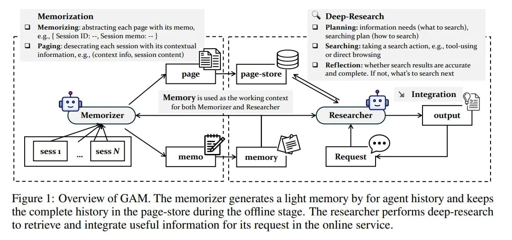

# Image Description

**File:** img_1765952462_aqadgg9rg5cleup_figure_overview_of_gam_the.jpg
**Original:** image.jpg
**Received:** 1765952462

## Extracted Text (OCR)

Figure |: Overview of GAM. The memorizer generates a light memory by for agent history and keeps the complete history in the page-store during the offline stage. [he researcher performs deep-research to retrieve and integrate useful information for its request in the online service.

<!-- image -->

## Usage Instructions

When referencing this image in markdown:
1. Use relative path based on file location
2. Add descriptive alt text based on OCR content above
3. Add text description BELOW the image for GitHub rendering

Example:
```markdown
 <!-- TODO: Broken image path -->

**Image shows:** [Describe what the image contains based on OCR]
```
