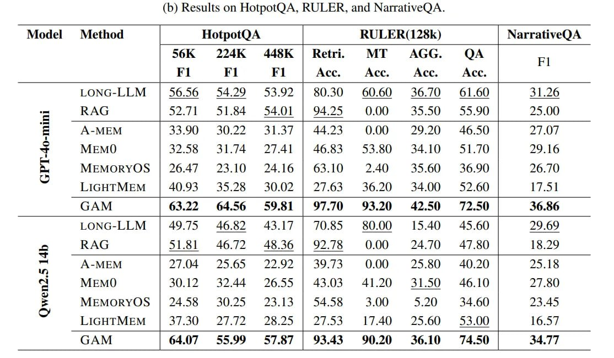

# Image Description

**File:** img_1765952462_aqadgw9rg5cleup_6_results_on_hotpotqa_ruler.jpg
**Original:** image.jpg
**Received:** 1765952462

## Extracted Text (OCR)

- (6) Results on HotpotQA, RULER, and NarrativeQA.

|                                                                                                                                                                                               | Method | HotpotQA RULER(128k) | NarrativeQA             | Method | HotpotQA RULER(128k) | NarrativeQA                    | Method | HotpotQA RULER(128k) | NarrativeQA   | Method | HotpotQA RULER(128k) | NarrativeQA   |
|-----------------------------------------------------------------------------------------------------------------------------------------------------------------------------------------------|---------------------------------------------------------|----------------------------------------------------------------|-----------------------------------------------|-----------------------------------------------|
|                                                                                                                                                                                               |                                                         | 56K  224K 443K  Retri.  MT  AGG  Fl Е  ЕТ                      |                                               |                                               |
| RAG | S2./1 31.84 54.01 | 94.25 000 £33.50 55.90 | 25.00                                                                                                                                      |                                                         | LONG-LLM | 56.56 54.29 53.92 | 80.30 60.60 36./0 61.60 | 31.26 |                                               |                                               |
| A-MEM МЕМО | 47 58 31./4 97;4| | 46.53 53.80 354.10 5Д | 29 16 MIEMORYOS | 264/ 23.10 274.16 | 63.10 2740 356 £46.90 | 26. /0) LIGHTMEM | 40.93 3528 3002? | 2763 3620 3400 #£=452.60 | 17.5] |                                                         |                                                                |                                               |                                               |
| GAM | 63.22 64.56 59.81 | 9770 9320 42.50 72.50 | 36.86                                                                                                                                       | RAG | 51.51 46./2 46.560 | 92./8 00 24./0 47.80 | 18.29 | LONG-LLM | 49.15 46.62 43.17 | /0.65 8000 15.49 45.60 | 29.69  |                                               |                                               |
| A-MEM  25.605  22.9) |  49 73  0.00  2S BU)  40 270) |  ыы  S 18 MEMO | 20.12 832.44 26.55 | 43.05 41.20 31.50 46.10 | 27.80                                                                  |                                                         |                                                                |                                               |                                               |
| MIEMORYOS LIGHTMEM | 3/.30 2/./2 28.25 | 2/55 1/40 25.60 33.00 | 16.5/                                                                                                                        |                                                         |                                                                |                                               |                                               |
| GAM | 64.07 $55.90 S787 | 93.43 970 36.10 7450 | 34 77                                                                                                                                        |                                                         |                                                                |                                               |                                               |

## Usage Instructions

When referencing this image in markdown:
1. Use relative path based on file location
2. Add descriptive alt text based on OCR content above
3. Add text description BELOW the image for GitHub rendering

Example:
```markdown
 <!-- TODO: Broken image path -->

**Image shows:** [Describe what the image contains based on OCR]
```
