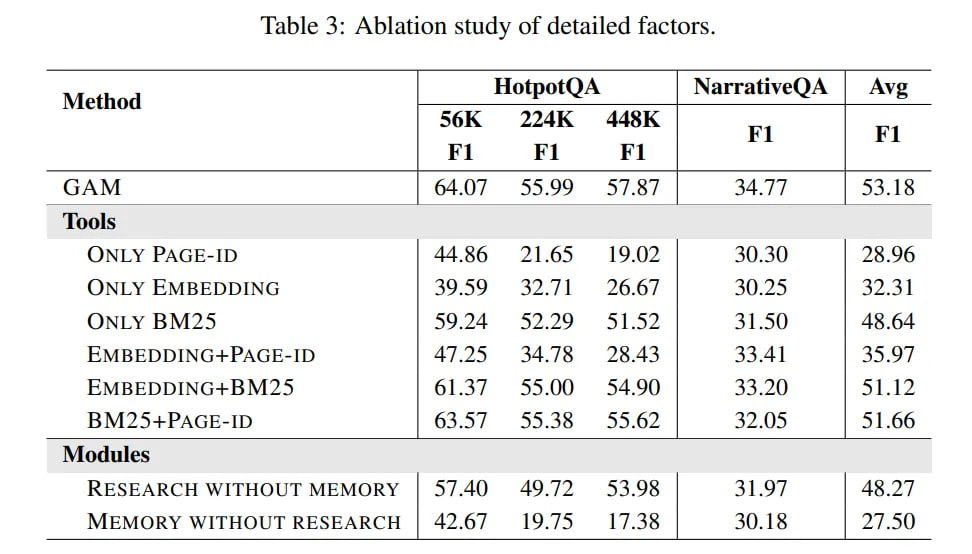

# Image Description

**File:** img_1765952462_aqadha9rg5cleup_lable_3_ablation_study_of_detailed.jpg
**Original:** image.jpg
**Received:** 1765952462

## Extracted Text (OCR)

lable 3: Ablation study of detailed factors.

|                                                    | Method  HotpotQA  NarrativeQA  Avg   |
|----------------------------------------------------|--------------------------------------|
|                                                    | 56K  224K 443K  Fl  Fl               |
| ‘Tools                                             |                                      |
| ONLY PAGE-ID | 44860 271.65 1907 | 30.30 | 2“ 96   |                                      |
| OONLY EMBEDDING  | 39.59  4) Ji  26.6/ |  | 47 3]  |                                      |
| ONLY BM?25  |1 SODA  SS? DY  5  152 |  | 48.64     |                                      |
| ERMBEDDING+PAGE-ID  14775  44 75  25.45 |  | 45.97 |                                      |
| KMBEDDING+BM?25  43.20)  | S| |?                   |                                      |
| 25+PAGE-ID | 63.5/ 55.358 £55.62 | 37.05 | 51.66   |                                      |
| Modules                                            |                                      |
| RESEARCH WITHOUT MEMORY | 45/402) 49/2  S34 0K |   |                                      |
| MEMORY WITHOUT RESEARCH | 42.67  19 75             |                                      |

## Usage Instructions

When referencing this image in markdown:
1. Use relative path based on file location
2. Add descriptive alt text based on OCR content above
3. Add text description BELOW the image for GitHub rendering

Example:
```markdown
 <!-- TODO: Broken image path -->

**Image shows:** [Describe what the image contains based on OCR]
```
