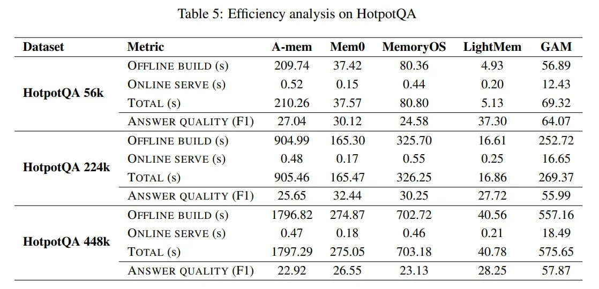

# Image Description

**File:** img_1765952462_aqadhq9rg5cleup_lable_5_efficiency_analysis_on_hotpotqa.jpg
**Original:** image.jpg
**Received:** 1765952462

## Extracted Text (OCR)

lable 5: Efficiency analysis on HotpotQA

|                                                                           | Dataset Metric A-mem Mem0Q MemoryOS' = LightMem GAM   |
|---------------------------------------------------------------------------|-------------------------------------------------------|
| (OFFLINE BUILD (s) 209.14 31.42 $0.36 4.93 56.89                          |                                                       |
| (ONLINE SERVE ($) ONLINE SERVE (s)  HotpotQA 56k                          |                                                       |
| LOTAL ($) 210.26 Sif 50.50 5.13 69.32                                     |                                                       |
| ANSWER QUALITY (F1) 2/04 30.12 24.58 37.30 64.02                          |                                                       |
| OFFLINE BUILD (s) 904.99 165.30 3525.1} 16.61 В.Р                         |                                                       |
| ()NLINE SERVE ($) ONLINE SERVE (Ss)  HotpotQA 224k                        |                                                       |
| TOTAL (s) 905.46 — 165.47 326.25 16.56 269.3:                             |                                                       |
| ANSWER QUALITY (ЕП) 25.05 32.44 3U.25 27.72 55.99                         |                                                       |
| OFFLINE BUILD (s) 1196.52 2/4.8/ 202.72 40.56 557.16                      |                                                       |
| NLINE SERVE (s) ONLINE SERVE (s) 0.4/ 0.18 0.46 0.2] 18.49  HotpotQA 448k |                                                       |
| TOTAL (s) 1719729 275.05 /03.18 40.75 575.65                              |                                                       |
| ANSWER QUALITY (F1) 22.92 26.55 25.13 25.25 5/.8/                         |                                                       |

## Usage Instructions

When referencing this image in markdown:
1. Use relative path based on file location
2. Add descriptive alt text based on OCR content above
3. Add text description BELOW the image for GitHub rendering

Example:
```markdown
 <!-- TODO: Broken image path -->

**Image shows:** [Describe what the image contains based on OCR]
```
