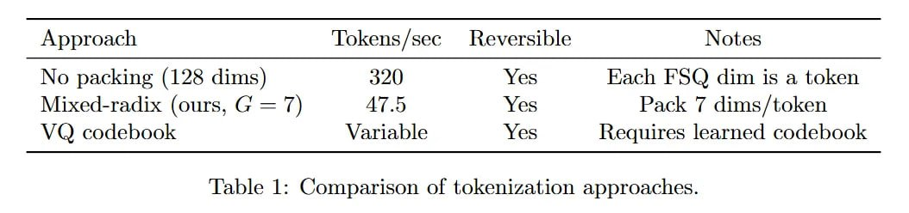

# Image Description

**File:** img_1766039991_aqadmrnrg5clgup_5910_5_29_59_yovoiddy.jpg
**Original:** image.jpg
**Received:** 1766039991

## Extracted Text (OCR)

| 5910М Э[Чт5лэле[  29$/59эуоТ, yovoiddy              |                                                       |
|-----------------------------------------------------|-------------------------------------------------------|
|                                                     | 933401 ® SI ипр OS qoreq SOX OzE (SUIIP QZ) supped on |
| usyo}/StIp J Ява SOx CUP () = =) ‘simo) хтрел-рэхиА |                                                       |
|                                                     | yYOOCIpOD pouIey] зэатарэ SOX эаеттел yYOoqspod CA    |

‘зэцоволайе UOTJVZTUVYO} JO позттеотос) :1 эае®т

## Usage Instructions

When referencing this image in markdown:
1. Use relative path based on file location
2. Add descriptive alt text based on OCR content above
3. Add text description BELOW the image for GitHub rendering

Example:
```markdown
 <!-- TODO: Broken image path -->

**Image shows:** [Describe what the image contains based on OCR]
```
