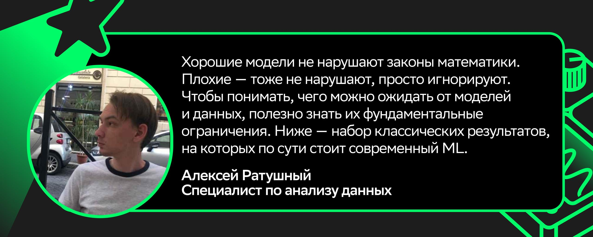

# Image Description

**File:** img_1766148148_aqadobbrg8zykup8_image.jpg
**Original:** image.jpg
**Received:** 1766148148

## Extracted Text (OCR)

<!-- image -->

Хорошие модели не нарушают законы математики. | лохие — тоже не нарушают, просто игнорируют. Чтобы понимать, чего можно ожидать от моделей и данных, полезно знать UX фундаментальные ограничения. Ниже — набор классических результатов, на которых по сути стоит современный ML.

Алексеи Ратушный Специалист по анализу данных

## Usage Instructions

When referencing this image in markdown:
1. Use relative path based on file location
2. Add descriptive alt text based on OCR content above
3. Add text description BELOW the image for GitHub rendering

Example:
```markdown
 <!-- TODO: Broken image path -->

**Image shows:** [Describe what the image contains based on OCR]
```
