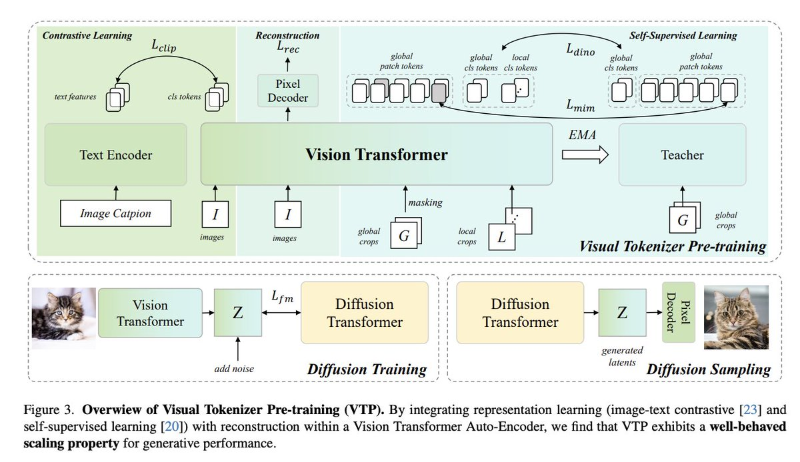

# Image Description

**File:** img_1766214951_aqad7g5rgnwkup_figure_3_overwiew_of_visual_tokenizer.jpg
**Original:** image.jpg
**Received:** 1766214951

## Extracted Text (OCR)

Figure 3. Overwiew of Visual Tokenizer Pre-training (VTP). By integrating representation learning (image-text contrastive [23] and seli-supervised learning [20]) with reconstruction within a Vision l[ransformer Auto-Encoder, we find that VIP exhibits a well-behaved scaling property for generative performance.

<!-- image -->

## Usage Instructions

When referencing this image in markdown:
1. Use relative path based on file location
2. Add descriptive alt text based on OCR content above
3. Add text description BELOW the image for GitHub rendering

Example:
```markdown
 <!-- TODO: Broken image path -->

**Image shows:** [Describe what the image contains based on OCR]
```
