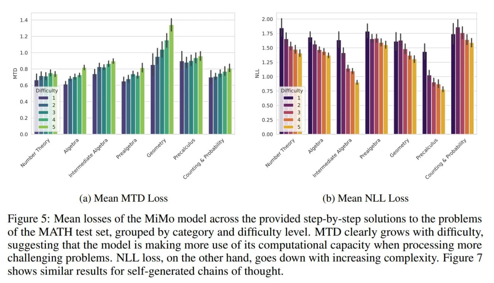

# Image Description

**File:** img_1766300181_aqadug5rg00fiep_figure_5_mean_losses_of_the.jpg
**Original:** image.jpg
**Received:** 1766300181

## Extracted Text (OCR)

Figure 5: Mean losses of the MiMo model across the provided step-by-step solutions to the problems of the MATH test set, grouped by category and difficulty level. MTD clearly grows with difficulty, suggesting that the model is making more use of its computational capacity when processing more challenging problems. NLL loss, on the other hand, goes down with increasing complexity. Figure 7 shows similar results for self-generated chains of thought.

<!-- image -->

## Usage Instructions

When referencing this image in markdown:
1. Use relative path based on file location
2. Add descriptive alt text based on OCR content above
3. Add text description BELOW the image for GitHub rendering

Example:
```markdown
 <!-- TODO: Broken image path -->

**Image shows:** [Describe what the image contains based on OCR]
```
