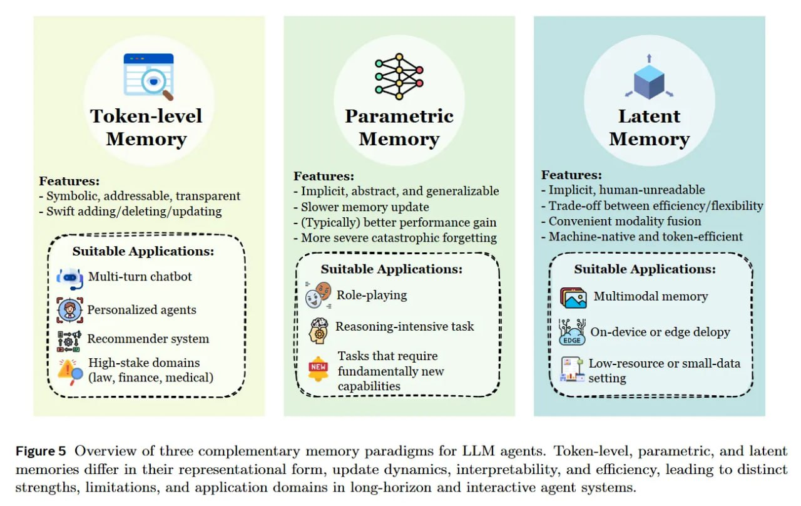

# Image Description

**File:** img_1766300220_aqadng9rg00fkep_image_figure5_overview_ol.jpg
**Original:** image.jpg
**Received:** 1766300220

## Extracted Text (OCR)

<!-- image -->

Figure5 Overview ol three complementary memory paradigms tor LLM agents. 'Loken-level, parametric, and latent memories differ in their representational form, update dynamics, interpretability, and efhiciency, leading to distinct strengths, limitations, and application domains in long-horizon and interactive agent systems.

## Usage Instructions

When referencing this image in markdown:
1. Use relative path based on file location
2. Add descriptive alt text based on OCR content above
3. Add text description BELOW the image for GitHub rendering

Example:
```markdown
 <!-- TODO: Broken image path -->

**Image shows:** [Describe what the image contains based on OCR]
```
