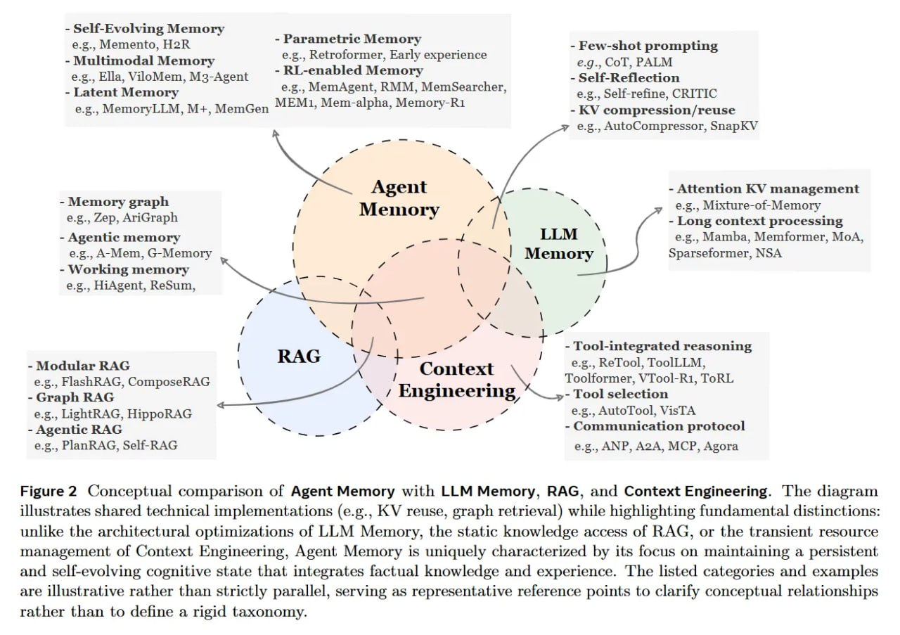

# Image Description

**File:** img_1766300220_aqadnq9rg00fkep_figure_2_conceptual_comparison_ol_agent.jpg
**Original:** image.jpg
**Received:** 1766300220

## Extracted Text (OCR)

Figure 2 Conceptual comparison ol Agent Memory with LLM Memory, RAG, and Context Engineering. The diagram illustrates shared technical implementations (e.g., KV reuse, graph retrieval) while highlighting fundamental distinctions: unlike the architectural optimizations of LLM Memory, the static knowledge access of ВАС, or the transient resource management of Context Engineering, Agent Memory is uniquely characterized by its focus on maintaining a persistent and sell-evolving cognitive state that integrates lactual knowledge and experience. 'The listed categories and examples are illustrative rather than strictly parallel, serving as representative reference points to clarify conceptual relationships rather than to define a rigid taxonomy.

<!-- image -->

## Usage Instructions

When referencing this image in markdown:
1. Use relative path based on file location
2. Add descriptive alt text based on OCR content above
3. Add text description BELOW the image for GitHub rendering

Example:
```markdown
 <!-- TODO: Broken image path -->

**Image shows:** [Describe what the image contains based on OCR]
```
