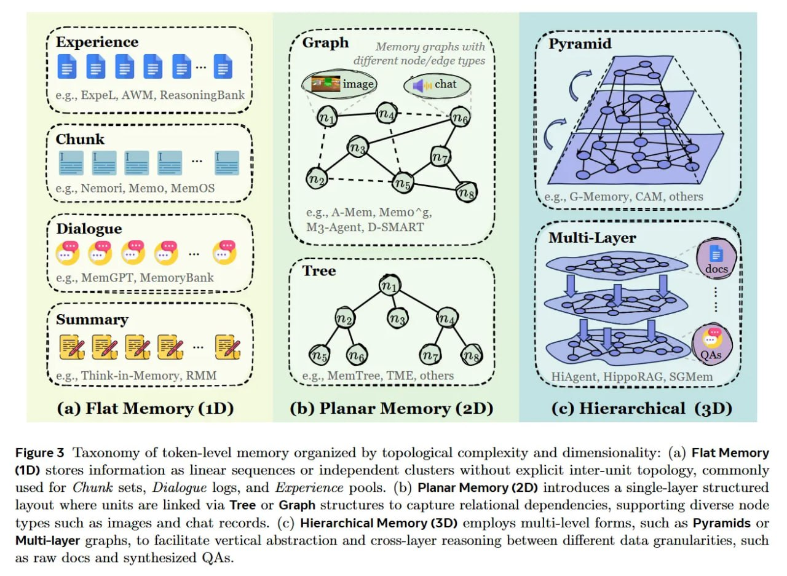

# Image Description

**File:** img_1766300220_aqadnw9rg00fkep_a_ee_el_le_ee_es.jpg
**Original:** image.jpg
**Received:** 1766300220

## Extracted Text (OCR)

a ee EL Le ee eS Te ne Me Ow ae ee \_ = = = = a 2 a,

-
Memory graphs with \

Experience 1 / Graph

different node/edge types
ae р УЧИ

ane

<!-- image -->

Chunk

-——\_

— —\_—\_— &lt;\_&lt;

—— —

a

ll
a
il
ll

. e.g., Nemori, Memo, MemOS

<!-- image -->

<!-- image -->

<!-- image -->

<!-- image -->

<!-- image -->

ss

<!-- image -->

е.р., А-Мет, Memo"g, ‚ M3-Agent, D-SMARTI

<!-- image -->

aaa eae eee aS aS 95 9 5 aS = SSS eS eS Se a.

ower - es ese mB ew Bw eB Se Se Se Se eB Se Se ee ee ee =

# lack re

<!-- image -->

<!-- image -->

<!-- image -->

<!-- image -->

a
| Sammarv

у KRPRRREREREGCRE А

Ne

<!-- image -->

\_

а Г М,
wei wea

Cray eee
РТ

<!-- image -->

<!-- image -->

<!-- image -->

<!-- image -->

', e.g., Think-in- -Memory, RMM ‘ ` `.е.5.. MemtTree, TME, others „ ых НАвем, HippoRAG, ЗС Мет

455 вишь чар пи ак аа ав зв ав в ао ао ао аа па ча а ва пы р пе = а = + лиш AA ee ea ааа Ss ade = pt | Pepe aa re eed PT pelea [pacer Pee

<!-- image -->

(a) Flat Memory (1D) (b) Planar Memory (2D) (c) Hierarchical (3D)

<!-- image -->

<!-- image -->

Figure $ Taxonomy of token-level memory organized by topological complexity and dimensionality: (a) Flat Memory (1D) stores information as linear sequences or independent clusters without explicit inter-unit topology, commonly used for Chunk sets, Dialogue logs, and Experience pools. (b) Planar Memory (2D) introduces a single-layer structured layout where units are linked via Tree or Graph structures to capture relational dependencies, supporting diverse node types such as images and chat records. (c) Hierarchical Memory (3D) employs multi-level forms, such as Pyramids or Multi-layer graphs, to facilitate vertical abstraction and cross-layer reasoning between different data granularities, such as raw docs and synthesized QAs.

## Usage Instructions

When referencing this image in markdown:
1. Use relative path based on file location
2. Add descriptive alt text based on OCR content above
3. Add text description BELOW the image for GitHub rendering

Example:
```markdown
 <!-- TODO: Broken image path -->

**Image shows:** [Describe what the image contains based on OCR]
```
