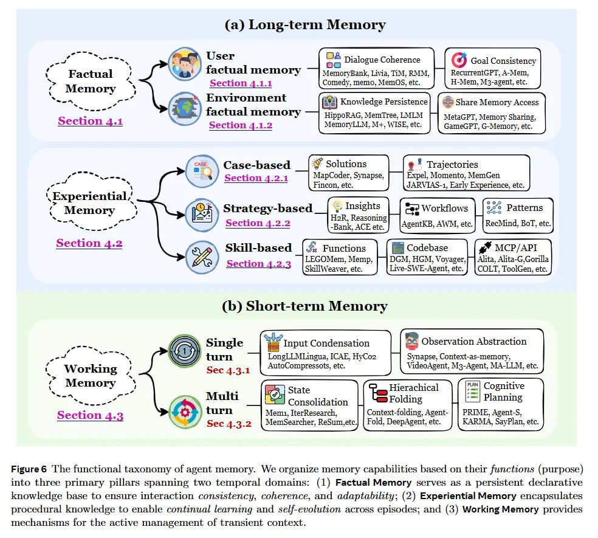

# Image Description

**File:** img_1766300220_aqadoq9rg00fkep_figure6_functional_taxonomy_of_agent.jpg
**Original:** image.jpg
**Received:** 1766300220

## Extracted Text (OCR)

Figure6 "Ге functional taxonomy of agent memory. We organize memory capabilities based on their functions (purpose } into three primary pillars spanning two temporal domains: (1) Factual Memory serves as a persistent declarative knowledge base to ensure interaction consistency, coherence, and adaptability; (2) Experiential Memory encapsulates procedural knowledge to enable continual learning and self-evolution across episodes; and (3) Working Memory provides mechanisms for the active management of transient context.

<!-- image -->

## Usage Instructions

When referencing this image in markdown:
1. Use relative path based on file location
2. Add descriptive alt text based on OCR content above
3. Add text description BELOW the image for GitHub rendering

Example:
```markdown
 <!-- TODO: Broken image path -->

**Image shows:** [Describe what the image contains based on OCR]
```
