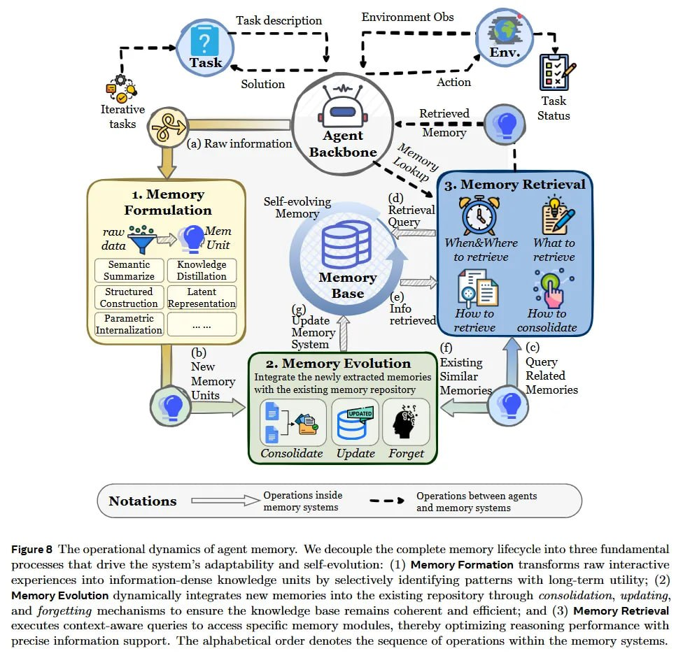

# Image Description

**File:** img_1766300220_aqadow9rg00fkep_figure_8_he_operational_dynamics_of.jpg
**Original:** image.jpg
**Received:** 1766300220

## Extracted Text (OCR)

Figure 8 'he operational dynamics of agent memory. We decouple the complete memory lifecycle into three findamental processes that drive the system's adaptability and selievolution: (1) Memory Formation transforms raw interactive experiences into information-dense knowledge units by selectively identifying patterns with long-term utility; (2) Memory Evolution dynamically integrates new memories into the existing repository through consolidation, updating. and forgetting mechanisms to ensure the knowledge base remains coherent and efficient; and (3) Memory Retrieval executes context-aware queries to access speciic memory modules, thereby optimizing reasoning performance with precise information support. The alphabetical order denotes the sequence of operations within the memory systems.

<!-- image -->

## Usage Instructions

When referencing this image in markdown:
1. Use relative path based on file location
2. Add descriptive alt text based on OCR content above
3. Add text description BELOW the image for GitHub rendering

Example:
```markdown
 <!-- TODO: Broken image path -->

**Image shows:** [Describe what the image contains based on OCR]
```
