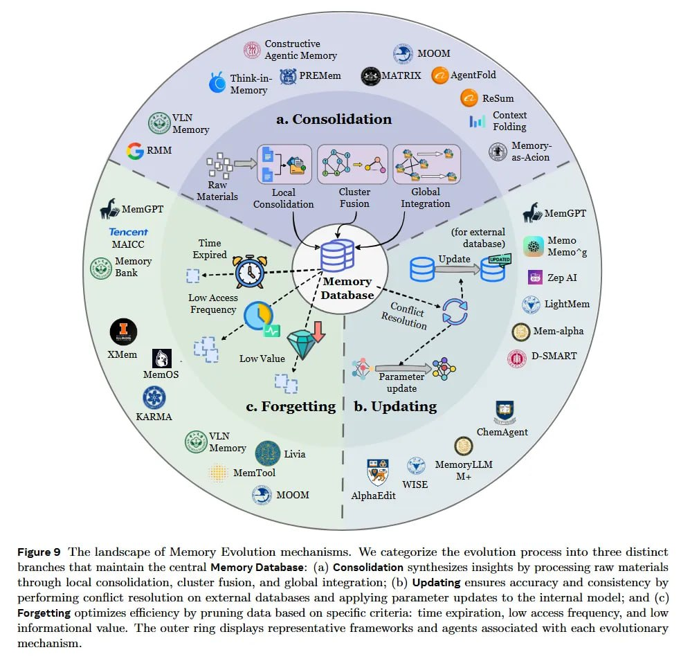

# Image Description

**File:** img_1766300220_aqadpa9rg00fkep_figure9_the_landscape_of_memory_evolutio.jpg
**Original:** image.jpg
**Received:** 1766300220

## Extracted Text (OCR)

Figure9 'The landscape of Memory Evolution mechanisms. We categorize the evolution process into three distinct branches that maintain the central Memory Database: (a) Consolidation synthesizes insights by processing raw materials through local consolidation, cluster fusion, and global integration; (b) Updating ensures accuracy and consistency by performing conflict resolution on external databases and applying parameter updates to the internal model; and (с) Forgetting optimizes eficiency by pruning data based on specific criteria: time expiration, low access frequency, and low informational value. 'The outer ring displays representative frameworks and agents associated with each evolutionary mechanism.

<!-- image -->

## Usage Instructions

When referencing this image in markdown:
1. Use relative path based on file location
2. Add descriptive alt text based on OCR content above
3. Add text description BELOW the image for GitHub rendering

Example:
```markdown
 <!-- TODO: Broken image path -->

**Image shows:** [Describe what the image contains based on OCR]
```
