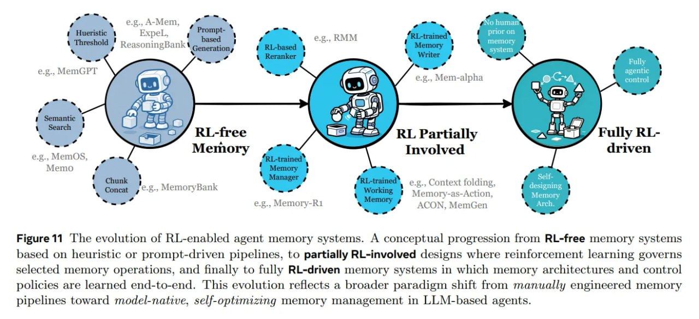

# Image Description

**File:** img_1766300220_aqadpg9rg00fkep_figure_11_lhe_evolution_of_rl_enabled.jpg
**Original:** image.jpg
**Received:** 1766300220

## Extracted Text (OCR)

Figure 11 lhe evolution of RL-enabled agent memory systems. A conceptual progression from RL-free memory systems based on heuristic or prompt-driven pipelines, to partially RL-involved designs where reinforcement learning governs selected memory operations, and finally to fully RL-driven memory systems in which memory architectures and control policies are learned end-to-end. This evolution reflects a broader paradigm shift from manually engineered memory pipelines toward model-native, self-optimizing memory management in LLM-based agents.

<!-- image -->

## Usage Instructions

When referencing this image in markdown:
1. Use relative path based on file location
2. Add descriptive alt text based on OCR content above
3. Add text description BELOW the image for GitHub rendering

Example:
```markdown
 <!-- TODO: Broken image path -->

**Image shows:** [Describe what the image contains based on OCR]
```
