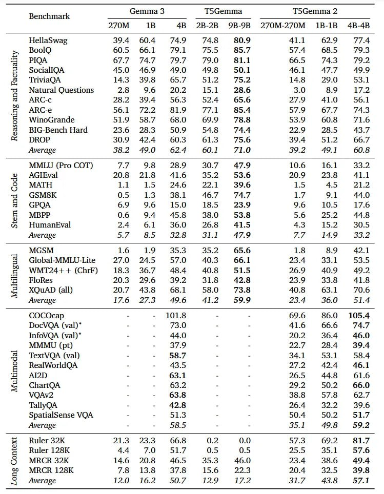

# Image Description

**File:** img_1766301577_aqads1drgeuoep_emma_3_tt_s_iemma.jpg
**Original:** image.jpg
**Received:** 1766301577

## Extracted Text (OCR)

|                                                                           | (,emma 3  ‘tT S(iemma                          | (,emma 3  ‘tT S(iemma   | (,emma 3  ‘tT S(iemma   |
|---------------------------------------------------------------------------|------------------------------------------------|-------------------------|-------------------------|
|                                                                           | TB  4B 7B-4KH YGR-GR 24/UM-24/0M  LB-1B  4B-48 |                         |                         |
| HellaSwag 394 604 749 74.8 89.9 41.1 62.9 77.4                            |                                                |                         |                         |
| „ BoolO 60.5 66.1 79.1 75.5 85.7 57.4 68.5 79.3                           |                                                |                         |                         |
| alit  РЮА  67.7 747  79.7  79.0  81.1  66.5  74.3  79.2                   |                                                |                         |                         |
| Cu  SociallOA  45.0 46.9  49.0  49.8  50.1  46.1  Ay?  49.9               |                                                |                         |                         |
| бы od  it  TriviaQA  14.3 39.8  65.7  51.2  75.2  14.8  29.0  53.1        |                                                |                         |                         |
| =) Natural Questions 2.8 9.6 20.2 15.1 28.6 3.0 8.9 17.2                  |                                                |                         |                         |
| el!  ARC-c  38.2 390.4  56.3  B27 4  65.6  27.9  41.0  56.1               |                                                |                         |                         |
| Ing  ARC-e  56.1  72.2  81.09  77.1  85.4  57.9  67.7  74.3               |                                                |                         |                         |
| = WinoGrande 51.9 587 68.0 69.9 78.8 53.9 60.8 #£«712.6                   |                                                |                         |                         |
| BIG-Bench Hard 23.6 28.3 50.9 54.8 74.4 22.9 28.5 43.7  a)                |                                                |                         |                         |
| x= DROP  30.9 44  60.3  61.3  75.6  390.4  51.2  66.7                     |                                                |                         |                         |
| Average 38.2 490 62.4 60.1 71.0 39.2 49.1 60.8                            |                                                |                         |                         |
| MMLU (Pro COT) 7.F 98 $£=28.9 30.7 47.9 10.6 16.1 33.2                    |                                                |                         |                         |
| de  AGTEval  20.8 21.8  41.6  35.2  53.6  20.9  23.8  41.1                |                                                |                         |                         |
| Lo  MATH  1.1  1.5  24.6  22.1  39.6  1.5  4.5  21.2                      |                                                |                         |                         |
| <7 СМА U5 13 36.1 46./ У Ly $.1                                           |                                                |                         |                         |
| 3  GPOA  6.9  9.6  15.0  18.5  23.9  9.6  10.5  17.6                      |                                                |                         |                         |
| MBPP  0.6  9.4  45.8  38.0  53.8  5.6  25.2                               |                                                |                         |                         |
| ce HumanEval 24 6.1 £36.00 26.8 41.5 43 15.2 30.5                         |                                                |                         |                         |
| Average af 8.2 24.6 S15 4/.9 ff L490 SoA                                  |                                                |                         |                         |
| MGSM lo 19 35.3 35.2 65.6 1.8 8.9 42.1                                    |                                                |                         |                         |
| <  Global-MMLU-Lite 27.0 245 57.0 40.3 66.1 23.4 33.1 53.5                |                                                |                         |                         |
| ing  WMT24++ (ChrF)  18.3 36.7  48.4  40.8  51.5  26.9  40.9  49.2        |                                                |                         |                         |
| Iti]  FloRes  20.3 29.6  39.2  31.8  42.8  23.9  33.8  41.8               |                                                |                         |                         |
| = XQuAD (all) 20.7 43.8 68.1 58.0 73.8 40.8 63.1 70.6  = aa A el A te = С |                                                |                         |                         |
| Average 17.6 27.3 49.6 41.2 59.9 23.4 36.0 51.4                           |                                                |                         |                         |
| COCOcap - - 101.8 - - 69.6 86.0 105.4                                     |                                                |                         |                         |
| DocVOA (val)* - - 73.0 - - 41.6 66.6 74.7                                 |                                                |                         |                         |
| InfoVOA (val)*  20.2  36.4                                                |                                                |                         |                         |
| MMMU (pt)  af.9  24.7  28.4  39.4                                         |                                                |                         |                         |
| . . 34.1 53.1 584 $  TextVOA (val) J - §8.7  ae |                         |                                                |                         |                         |
| = RealWorldQA - - 43.5 - - 27.2 42.4                                      |                                                |                         |                         |
| Iti  АО  63.1  26.5  448  61.6                                            |                                                |                         |                         |
| = ChartQA - - 63.2 . - 29.2 50.2 66.0                                     |                                                |                         |                         |
| VOAV2 - - 63.8 - - 38.8 57.8 62.7                                         |                                                |                         |                         |
| TallyOA - - 42.8 - - 26.4 32.2 39.6                                       |                                                |                         |                         |
| Spatialsense VOA - - 51.3 - - 50.4 50.2 51.7                              |                                                |                         |                         |
| Average - - 28.5 - - 535.1 495 39.1                                       |                                                |                         |                         |
| —  =  =  Ruler 32K  21.3 23.3  66.8  0.2  0.0  57.3  69.2  81.7           |                                                |                         |                         |
| = Ruler 126K 4.4 7.0 51.7 0.5 0.5 25.5 35.1 57.6                          |                                                |                         |                         |
| 3  MRCR 32K 14.6 20.8 46.5 35.3 46.0 23.4 38.6 49.4                       |                                                |                         |                         |
| о  МЕСА 128K 7.6 13.8 37.8 15.6 22.3 29.4 32.5 39.8                       |                                                |                         |                         |
| ЭЗ Average 12.0 162 507 12.9 1712 31.7 43.8 57.1                          |                                                |                         |                         |

## Usage Instructions

When referencing this image in markdown:
1. Use relative path based on file location
2. Add descriptive alt text based on OCR content above
3. Add text description BELOW the image for GitHub rendering

Example:
```markdown
 <!-- TODO: Broken image path -->

**Image shows:** [Describe what the image contains based on OCR]
```
