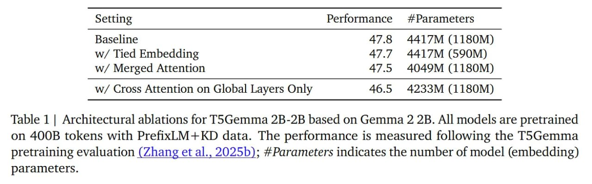

# Image Description

**File:** img_1766301577_aqadsldrgeuoep_setting_performance_parameters.jpg
**Original:** image.jpg
**Received:** 1766301577

## Extracted Text (OCR)

|                                                             | Setting Performance #Parameters   |
|-------------------------------------------------------------|-----------------------------------|
|                                                             | Baseline 47.8 4417M (1180M)       |
| w/ Tied Embedding 47.7 4417M (590M)                         |                                   |
| w/ Merged Attention 47.5 4049М (1180M)                      |                                   |
| w/ Cross Attention on Global Layers Only 46.5 4233M (1180M) |                                   |

Table 1 | Architectural ablations for TsGemma 2B-2B based on Gemma 2 2B. All models are pretrained оп 400B tokens with PrefixLM+KD data. The performance is measured following the TS5Gemma pretraining evaluation (Zhang et al., 20255); #Parameters indicates the number of model (embedding) parameters.

## Usage Instructions

When referencing this image in markdown:
1. Use relative path based on file location
2. Add descriptive alt text based on OCR content above
3. Add text description BELOW the image for GitHub rendering

Example:
```markdown
 <!-- TODO: Broken image path -->

**Image shows:** [Describe what the image contains based on OCR]
```
