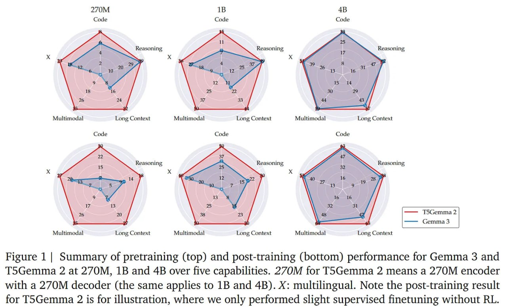

# Image Description

**File:** img_1766301577_aqadtldrgeuoep_figure_1_summary_of_pretraining.jpg
**Original:** image.jpg
**Received:** 1766301577

## Extracted Text (OCR)

Figure 1 | Summary of pretraining (top) and post-training (bottom) performance for Gemma 3 and T5Gemma 2 at 270M, 1B and 4B over five capabilities. 270M for TsGemma 2 means a 270M encoder with a 270M decoder (the same applies to 1B and 4B). X: multilingual. Note the post-training result for TS5Gemma 2 is for illustration, where we only performed slight supervised finetuning without RL.

<!-- image -->

## Usage Instructions

When referencing this image in markdown:
1. Use relative path based on file location
2. Add descriptive alt text based on OCR content above
3. Add text description BELOW the image for GitHub rendering

Example:
```markdown
 <!-- TODO: Broken image path -->

**Image shows:** [Describe what the image contains based on OCR]
```
