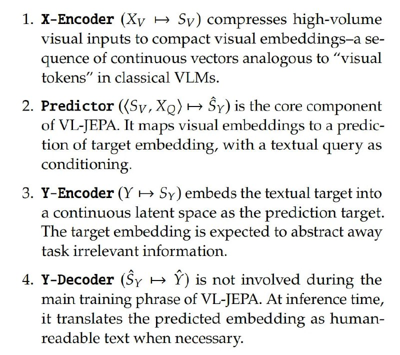

# Image Description

**File:** img_1766325875_aqadgrfrgr2qep9_x_encoder_sy.jpg
**Original:** image.jpg
**Received:** 1766325875

## Extracted Text (OCR)

- ‚ X-Encoder (Ху + Sy) compresses high-volume visual inputs to compact visual embeddings-—a sequence of continuous vectors analogous to "visual tokens" in classical VLMs.
- ‚ Predictor ((Sy, Xg) &gt; Sy) is the core component of VL-JEPA. It maps visual embeddings to a prediction of target embedding, with a textual query as conditioning.
- . ¥-Encoder (У +&gt; Sy) embeds the textual target into a continuous latent space as the prediction target. The target embedding is expected to abstract away task irrelevant intormation.
- ‚ ¥-Decoder (Sy +» У) is not involved during the main training phrase of VL-JEPA. At inference time, it translates the predicted embedding as humanreadable text when necessary.

## Usage Instructions

When referencing this image in markdown:
1. Use relative path based on file location
2. Add descriptive alt text based on OCR content above
3. Add text description BELOW the image for GitHub rendering

Example:
```markdown
 <!-- TODO: Broken image path -->

**Image shows:** [Describe what the image contains based on OCR]
```
