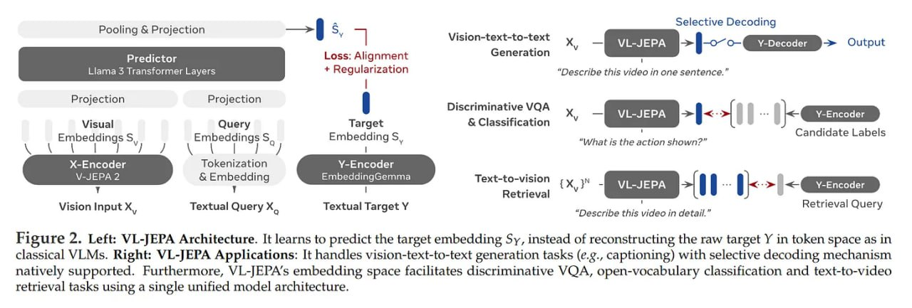

# Image Description

**File:** img_1766325875_aqadgxfrgr2qep_figure_2_left_vl_jepa_architecture_it.jpg
**Original:** image.jpg
**Received:** 1766325875

## Extracted Text (OCR)

Figure 2. Left: VL-JEPA Architecture. It learns to predict the target embedding Sy, instead of reconstructing the raw target Y in token space as in classical VLMs. Right: VL-JEPA Applications: It handles vision-text-to-text generation tasks (e.¢., captioning) with selective decoding mechanism natively supported. Furthermore, VL-]EPA's embedding space facilitates discriminative VOA, open-vocabulary classification and text-to-video retrieval tasks using a single unified model architecture.

<!-- image -->

## Usage Instructions

When referencing this image in markdown:
1. Use relative path based on file location
2. Add descriptive alt text based on OCR content above
3. Add text description BELOW the image for GitHub rendering

Example:
```markdown
 <!-- TODO: Broken image path -->

**Image shows:** [Describe what the image contains based on OCR]
```
