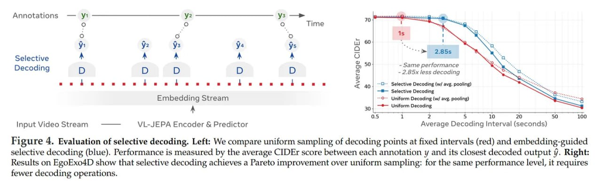

# Image Description

**File:** img_1766325875_aqadhbfrgr2qep_figure_4_evaluation_of_selective_decodin.jpg
**Original:** image.jpg
**Received:** 1766325875

## Extracted Text (OCR)

Figure 4. Evaluation of selective decoding. Left: We compare uniform sampling of decoding points at fixed intervals (red) and embedding-guided selective decoding (blue). Performance is measured Бу the average CIDEr score between each annotation у and its closest decoded output i. Right: Results on EgoExo4D show that selective decoding achieves a Pareto improvement over uniform sampling: for the same performance level, it requires fewer decoding operations.

<!-- image -->

## Usage Instructions

When referencing this image in markdown:
1. Use relative path based on file location
2. Add descriptive alt text based on OCR content above
3. Add text description BELOW the image for GitHub rendering

Example:
```markdown
 <!-- TODO: Broken image path -->

**Image shows:** [Describe what the image contains based on OCR]
```
