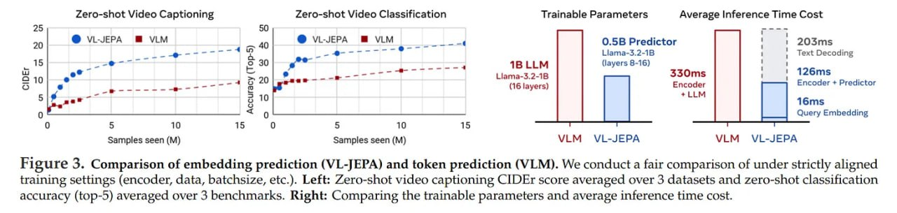

# Image Description

**File:** img_1766325875_aqadhxfrgr2qep_figure_3_comparison_of_embedding_predict.jpg
**Original:** image.jpg
**Received:** 1766325875

## Extracted Text (OCR)

Figure 3. Comparison of embedding prediction (VL-JEPA) and token prediction (VLM). We conduct a fair comparison of under strictly aligned training settings (encoder, data, batchsize, etc.). Left: Zero-shot video captioning CIDEr score averaged over 3 datasets and zero-shot classification accuracy (top-5) averaged over 3 benchmarks. Right: Comparing the trainable parameters and average inference time cost.

<!-- image -->

## Usage Instructions

When referencing this image in markdown:
1. Use relative path based on file location
2. Add descriptive alt text based on OCR content above
3. Add text description BELOW the image for GitHub rendering

Example:
```markdown
 <!-- TODO: Broken image path -->

**Image shows:** [Describe what the image contains based on OCR]
```
