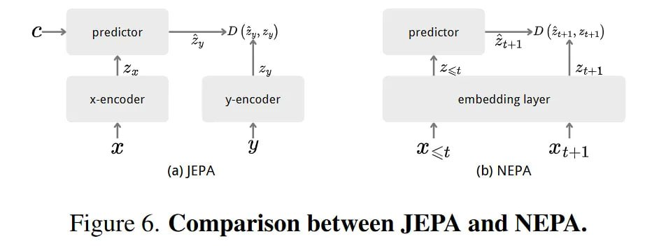

# Image Description

**File:** img_1766649048_aqadqatrgr2uep_figure_6_comparison_between_jepa_and.jpg
**Original:** image.jpg
**Received:** 1766649048

## Extracted Text (OCR)

Figure 6. Comparison between JEPA and NEPA.

<!-- image -->

## Usage Instructions

When referencing this image in markdown:
1. Use relative path based on file location
2. Add descriptive alt text based on OCR content above
3. Add text description BELOW the image for GitHub rendering

Example:
```markdown
 <!-- TODO: Broken image path -->

**Image shows:** [Describe what the image contains based on OCR]
```
