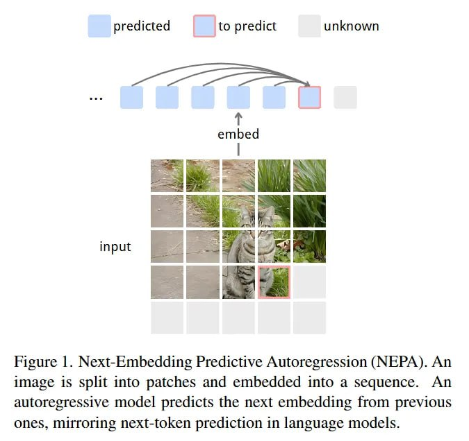

# Image Description

**File:** img_1766649048_aqadqqtrgr2uep9_figure_next_embedding_predictive_autoreg.jpg
**Original:** image.jpg
**Received:** 1766649048

## Extracted Text (OCR)

Figure |. Next-Embedding Predictive Autoregression (NEPA). An image 15 split into patches and embedded into a sequence. An autoregressive model predicts the next embedding from previous ones, mirroring next-token prediction in language models.

<!-- image -->

## Usage Instructions

When referencing this image in markdown:
1. Use relative path based on file location
2. Add descriptive alt text based on OCR content above
3. Add text description BELOW the image for GitHub rendering

Example:
```markdown
 <!-- TODO: Broken image path -->

**Image shows:** [Describe what the image contains based on OCR]
```
