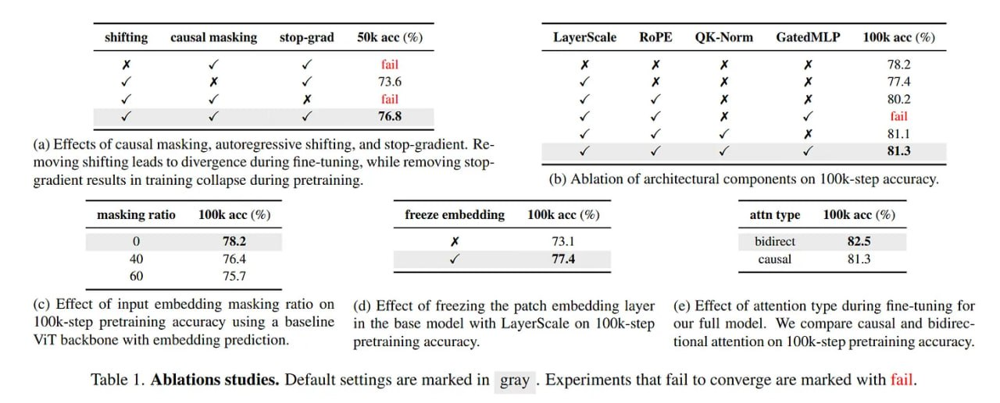

# Image Description

**File:** img_1766649048_aqadrgtrgr2uep_shifting_causalmasking_stop_grad_50k_acc.jpg
**Original:** image.jpg
**Received:** 1766649048

## Extracted Text (OCR)

shifting causalmasking  stop-grad 50k acc (%) LaverScale KRoPE $QK-Norm £/GatedMLP = 100K acc (%)

fail Хх р х г 7T8.2

73.6

TTA

fail ой м“ я Хх BO)?

TOS vw Wf г и lanl

$1.1

- (a) Effects of causal masking, autoregressive shifting, and stop-gradient. Ке- и и и и 81.3 moving shifting leads to divergence during fine-tuning, while removing stopgradient results in training collapse during pretraining. (b) Ablation of architectural components on 100k-step accuracy.

masking ratio LOUK ace (%e) freeze embedding LOOK ace (%) attn type OOK ace (%e)

9.2 я 731 bidirect 52.5

causal

- (с) Effect of input embedding masking ratio on (4) Effect of freezing the patch embedding layer (e) Effect of attention type during fine-tuning for \OOk-step pretraining accuracy using a baseline jin the base model with LayerScale on 100k-step our full model. We compare causal and bidirecУТ backbone with embedding prediction. pretraining accuracy. tional attention on |100k-step pretraining accuracy.

Table |. Ablations studies. Default settings are marked in gray . Experiments that fail to converge are marked with fail.

## Usage Instructions

When referencing this image in markdown:
1. Use relative path based on file location
2. Add descriptive alt text based on OCR content above
3. Add text description BELOW the image for GitHub rendering

Example:
```markdown
 <!-- TODO: Broken image path -->

**Image shows:** [Describe what the image contains based on OCR]
```
