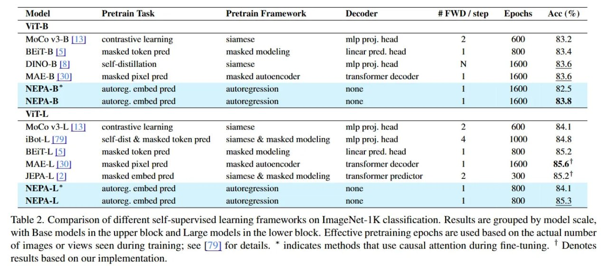

# Image Description

**File:** img_1766649048_aqadrwtrgr2uep_table_2_comparison_of_different_self_sup.jpg
**Original:** image.jpg
**Received:** 1766649048

## Extracted Text (OCR)

Table 2. Comparison of different self-supervised learning frameworks on ImageNet-1!K classification. Kesults are grouped by model! scale, with Base models 1n the upper block and Large models in the lower block. Effective pretraining epochs are used based on the actual number of images or views seen during training; see [79] for details. * indicates methods that use causal attention during fine-tuning. ' Denotes results based on our implementation.

|                                                                                              | Model Pretrain Task Pretrain Framework Decoder F#EFWD/step Epochs Асс 1%)   |
|----------------------------------------------------------------------------------------------|-----------------------------------------------------------------------------|
| MoCo v3-B [13| — contrastive learning siamese mip proj. head 2 600 83.2                      |                                                                             |
| BErT-B [5] masked token pred masked modeling linear pred. head | 800 83.4                    |                                                                             |
| DINO-B |5] sell-disuilation slamese mip pro. head N 1600 83                                  |                                                                             |
| MAE-B [50] masked pixel pred masked auloencoder translormer decoder 1 1600 83                |                                                                             |
| NEPA-B* autoreg. embed pred autoregression none | 1600 82.5                                  |                                                                             |
| NEPA-B autoreg. embed pred auloregression none | 1600 53.8                                   |                                                                             |
| № 11-Е.                                                                                      |                                                                             |
| MoCo v3-L|/4| — contrastive learning slamese mip proj. head 2 600 84.1                       |                                                                             |
| Во. | /9] sell-dist & masked token pred siamese & masked modeling mip proj. head 4 L000 54.8 |                                                                             |
| ВЕТГ. |5] masked token pred masked modeling linear pred. head | 800 85.2                     |                                                                             |
| MAE-L [30] masked pixel pred masked autoencoder transformer decoder | 1600 85.61             |                                                                             |
| JEPA-L |2| masked embed pred siamese & masked modeling _ transformer predictor 2 300 85.21   |                                                                             |
| NEPA-L”  auloreg. embed pred  auloregression  none  800                                      |                                                                             |
| NEPA-L  auloreg. embed pred  auloregression  none                                            |                                                                             |

## Usage Instructions

When referencing this image in markdown:
1. Use relative path based on file location
2. Add descriptive alt text based on OCR content above
3. Add text description BELOW the image for GitHub rendering

Example:
```markdown
 <!-- TODO: Broken image path -->

**Image shows:** [Describe what the image contains based on OCR]
```
