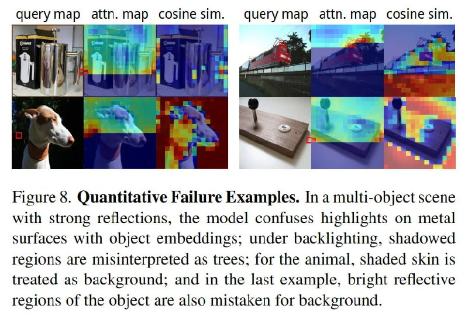

# Image Description

**File:** img_1766649048_aqadsgtrgr2uep9_querymap_attn_map_cosinesim_querymap.jpg
**Original:** image.jpg
**Received:** 1766649048

## Extracted Text (OCR)

querymap attn.map cosinesim. querymap ап. тар cosine sim.

<!-- image -->

Figure 8. Quantitative Failure Examples. In a multi-object scene with strong reflections, the model confuses highlights on metal surfaces with object embeddings; under backlighting, shadowed regions are misinterpreted as trees: for the animal, shaded skin 1$ treated as background; and in the last example, bright reflective regions of the object are also mistaken for background.

## Usage Instructions

When referencing this image in markdown:
1. Use relative path based on file location
2. Add descriptive alt text based on OCR content above
3. Add text description BELOW the image for GitHub rendering

Example:
```markdown
 <!-- TODO: Broken image path -->

**Image shows:** [Describe what the image contains based on OCR]
```
