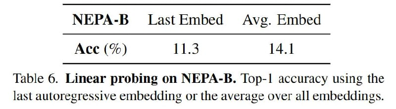

# Image Description

**File:** img_1766649048_aqadsqtrgr2uep9_nepa_b_last_embed_avg_embed.jpg
**Original:** image.jpg
**Received:** 1766649048

## Extracted Text (OCR)

## NEPA-B Last Embed Avg. Embed

Ace (%) 11.3 14.1

Table 6. Linear probing on NEPA-B. Top-| accuracy using the last autoregressive embedding or the average over all embeddings.

## Usage Instructions

When referencing this image in markdown:
1. Use relative path based on file location
2. Add descriptive alt text based on OCR content above
3. Add text description BELOW the image for GitHub rendering

Example:
```markdown
 <!-- TODO: Broken image path -->

**Image shows:** [Describe what the image contains based on OCR]
```
