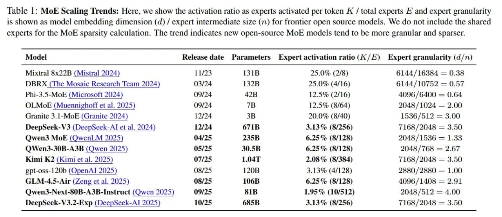

# Image Description

**File:** img_1766679721_aqadxg9rgwhcyep_lable_moe_scaling_trends_here.jpg
**Original:** image.jpg
**Received:** 1766679721

## Extracted Text (OCR)

lable |: MoE Scaling Trends: Here, we show the activation ratio as experts activated per token А / total experts &amp; and expert granularity is shown as model embedding dimension (d) / expert intermediate size (п) for frontier open source models. We do not include the shared experts for the MoE sparsity calculation. [he trend indicates new open-source MoE models tend to be more granular and sparser.

|                                         | Release date Parameters   |        | Expert activation ratio (4 / £)   | Expert granularity (d/7)   |
|-----------------------------------------|---------------------------|--------|-----------------------------------|----------------------------|
| Маха] 6x226B (Mistral 2024)             |                           |        | 25.0% (2/5)                       | 6144/16384 = 0.38          |
| DBRA (The Mosaic Research Team 2024)    |                           | 1328   | 25.0% (4/16)                      | 6144/10752 = 0.57          |
| Phi-3.5-MoE (Microsoft 2024)            |                           |        | 12.5% (2/16)                      | 4096/6400 = 0.64           |
| OLMorR (Muennignoff et al. 2025)        |                           |        | 12.5% (8/64)                      | 2048/1024 = 2.00           |
| Granite 3.1-МоЕ (Granite 2024)          |                           | ЗВ     | 20.0% (8/40)                      | 1536/512 = 3.00            |
| DeepSeek-V3 (DeepSeek-Al et al. 2024)   | 12/24                     | 6718   | 3.13% (8/256)                     | 7168/2048 = 3.50           |
| Owen3 Mok (QwenLM 2025)                 |                           |        | 6.25% (8/128)                     | 2048/1536 = 1.33           |
| OWen3-30B-A3B (Qwen 2025)               |                           | 30 SBR | 6.25% (8/125)                     | 2048 /768 = 2.67           |
| Kimi K2 (Kimi et al. 2025)              | (17/25                    | LO4aT  | 2.08 %o (8/384)                   | 7168/2048 = 3.50           |
| ept-oss-120b (OpenAL 2025)              |                           |        | 3.159% (4/128)                    | 2880/2880 = 1.00           |
| GLM-4.5-Air (Zeng et al. 2025)          | (8/25                     | 1068   | 6.25% (8/128)                     | 4096/1408 = 2.91           |
| Owen3-Next-50B-A3B-Instruct (Qwen 2025) | (9/25                     | KIB    | 1.95% (10/512)                    | 2048 /512 = 4.00           |
| DeepSeek-¥ 3.2-Exp (Deepseek-Al 2025)   |                           | Hs45K  | 3.14% (8/256)                     | 7168/2048 = 3.50           |

## Usage Instructions

When referencing this image in markdown:
1. Use relative path based on file location
2. Add descriptive alt text based on OCR content above
3. Add text description BELOW the image for GitHub rendering

Example:
```markdown
 <!-- TODO: Broken image path -->

**Image shows:** [Describe what the image contains based on OCR]
```
