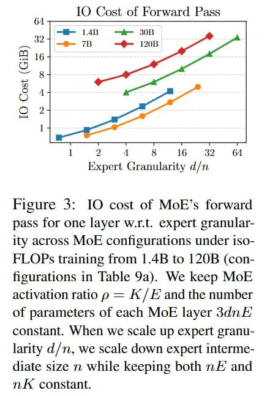

# Image Description

**File:** img_1766679721_aqadxw9rgwhcyep9_image_figure_3_io.jpg
**Original:** image.jpg
**Received:** 1766679721

## Extracted Text (OCR)

<!-- image -->

Figure 3: IO cost of MoE's forward pass for one layer w.r.t. expert granularity across MOE configurations under 1$0FLOPs training from 1.48 to 12О0В (conficurations in Table 9a). We keep MoE activation ratio р = КУЁ and the number of parameters of each MoE layer Зав А constant. When we scale up expert granularity d/n, we scale down expert intermediate size nm while keeping both п and mK constant.

## Usage Instructions

When referencing this image in markdown:
1. Use relative path based on file location
2. Add descriptive alt text based on OCR content above
3. Add text description BELOW the image for GitHub rendering

Example:
```markdown
 <!-- TODO: Broken image path -->

**Image shows:** [Describe what the image contains based on OCR]
```
