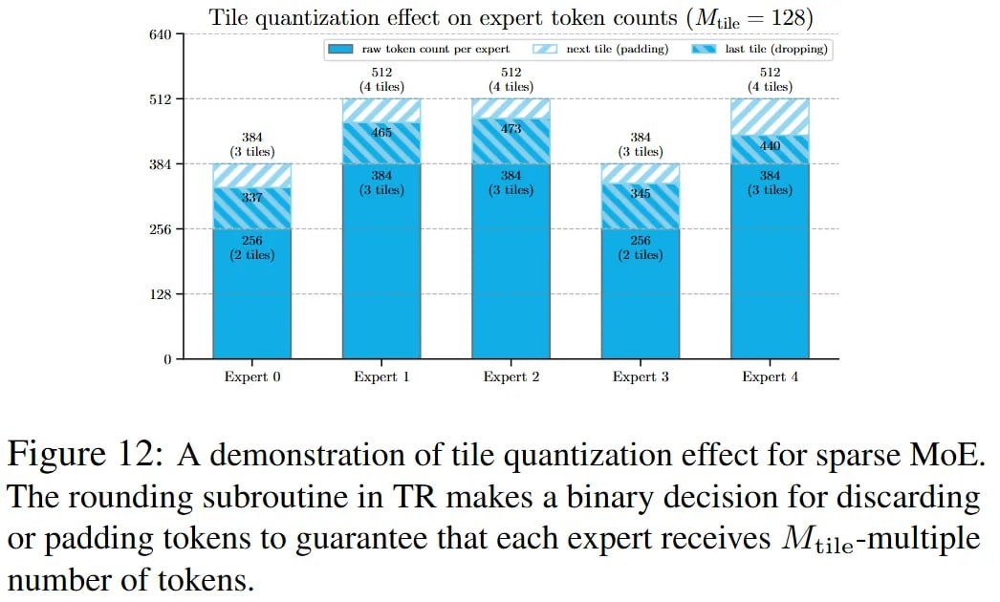

# Image Description

**File:** img_1766679721_aqadya9rgwhcyep_figure_2_a_demonstration_of_tile.jpg
**Original:** image.jpg
**Received:** 1766679721

## Extracted Text (OCR)

Figure |2: A demonstration of tile quantization effect for sparse MoE. The rounding subroutine in TR makes a binary decision for discarding or padding tokens to guarantee that each expert receives //;;).-multiple number of tokens.

<!-- image -->

## Usage Instructions

When referencing this image in markdown:
1. Use relative path based on file location
2. Add descriptive alt text based on OCR content above
3. Add text description BELOW the image for GitHub rendering

Example:
```markdown
 <!-- TODO: Broken image path -->

**Image shows:** [Describe what the image contains based on OCR]
```
