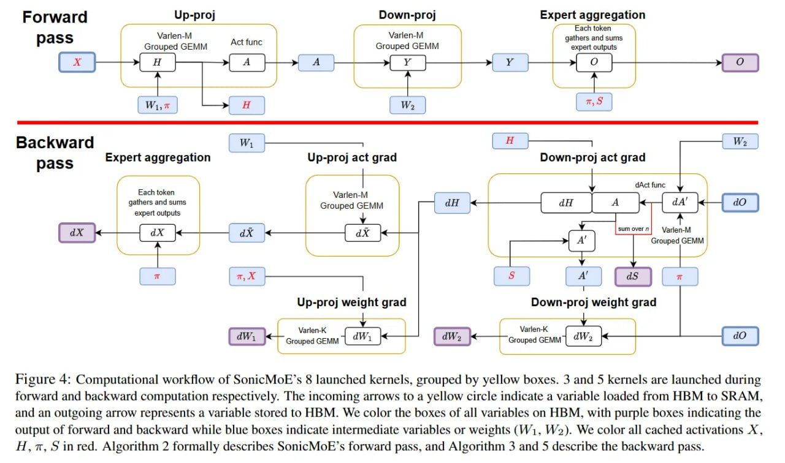

# Image Description

**File:** img_1766679721_aqadyg9rgwhcyep_rigure_4_computational_workflow_of_sonic.jpg
**Original:** image.jpg
**Received:** 1766679721

## Extracted Text (OCR)

rigure 4: Computational workflow of SonicMoE's 8 launched kernels, grouped by yellow boxes. 3 and 5 kernels are launched during forward and backward computation respectively. The incoming arrows to a yellow circle indicate a variable loaded from HBM to SRAM, and an outgoing arrow represents a variable stored to HBM. We color the boxes of all variables on HBM, with purple boxes indicating the output of forward and backward while blue boxes indicate intermediate variables ог weights (Wi, W2). We color all cached activations А, Н, п, о inred. Algorithm 2 formally describes SonicMoE's forward pass, and Algorithm 3 and 5 describe the backward pass.

<!-- image -->

## Usage Instructions

When referencing this image in markdown:
1. Use relative path based on file location
2. Add descriptive alt text based on OCR content above
3. Add text description BELOW the image for GitHub rendering

Example:
```markdown
 <!-- TODO: Broken image path -->

**Image shows:** [Describe what the image contains based on OCR]
```
